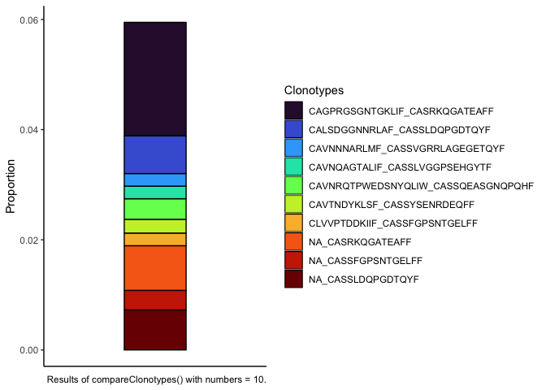
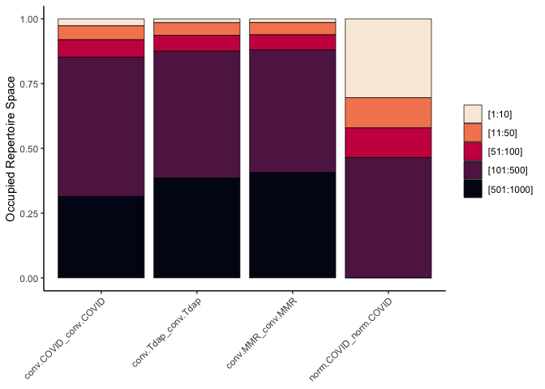
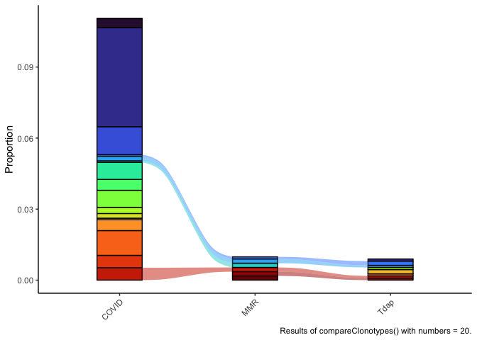

Last Updated June 22, 2023

# Single Cell V(D)J Analysis

## Packages

```r
if (!requireNamespace("BiocManager", quietly = TRUE)){
    install.packages("BiocManager")
}

if (!any(rownames(installed.packages()) == "ggplot2")){
  BiocManager::install("ggplot2")
}

if (!any(rownames(installed.packages()) == "viridis")){
  BiocManager::install("virids")
}

if (!any(rownames(installed.packages()) == "knitr")){
  BiocManager::install("knitr")
}

if (!any(rownames(installed.packages()) == "kableExtra")){
  BiocManager::install("kableExtra")
}

if (!any(rownames(installed.packages()) == "dplyr")){
  BiocManager::install("dplyr")
}

if (!any(rownames(installed.packages()) == "tidyr")){
  BiocManager::install("tidyr")
}

if (!any(rownames(installed.packages()) == "magrittr")){
  BiocManager::install("magrittr")
}

if (!any(rownames(installed.packages()) == "scRepertoire")){
  BiocManager::install("scRepertoire")
}

library(ggplot2)
library(viridis)
library(tidyr)
library(magrittr)
library(knitr)
library(kableExtra)
library(dplyr)
library(scRepertoire)
```

## Download Cell Ranger results

```r
options(timeout=1200)
download.file("https://raw.githubusercontent.com/ucdavis-bioinformatics-training/2023-June-Advanced-Topics-in-Single-Cell-RNA-Seq-VDJ/main/data_analysis/cellranger_vdj_results.zip", "cellranger_vdj_results.zip")
system("unzip cellranger_vdj_results.zip")
```

## Set-up

```r
experiment_name = "VDJ Example"
dataset_loc <- "./cellranger_vdj_results"
ids <- c("Pool1")
```

## Sequencing metrics

```r
metrics <- paste(dataset_loc, ids, "metrics_summary.csv", sep = "/")
metrics_table <- do.call("cbind", lapply(metrics, function(x) {
  as.data.frame(t(read.csv(x)))
  }))
colnames(metrics_table) <- ids
rownames(metrics_table) <- gsub(".", " ", rownames(metrics_table), fixed = TRUE)
metrics_table  %>%
  kable(caption = 'Cell Ranger Results') %>%
  pack_rows("Overview", 1, 3, label_row_css = "background-color: #666; color: #fff;") %>%
  pack_rows("Sequencing Characteristics", 4, 8, label_row_css = "background-color: #666; color: #fff;") %>%
  pack_rows("Mapping Characteristics", 9, 26, label_row_css = "background-color: #666; color: #fff;") %>%
  kable_styling("striped", fixed_thead = TRUE)
```

<table class="table table-striped" style="margin-left: auto; margin-right: auto;">
<caption>Cell Ranger Results</caption>
 <thead>
  <tr>
   <th style="text-align:left;position: sticky; top:0; background-color: #FFFFFF;">   </th>
   <th style="text-align:left;position: sticky; top:0; background-color: #FFFFFF;"> Pool1 </th>
  </tr>
 </thead>
<tbody>
  <tr grouplength="3"><td colspan="2" style="background-color: #666; color: #fff;"><strong>Overview</strong></td></tr>
<tr>
   <td style="text-align:left;padding-left: 2em;" indentlevel="1"> Estimated Number of Cells </td>
   <td style="text-align:left;"> 5,703 </td>
  </tr>
  <tr>
   <td style="text-align:left;padding-left: 2em;" indentlevel="1"> Mean Read Pairs per Cell </td>
   <td style="text-align:left;"> 49,067 </td>
  </tr>
  <tr>
   <td style="text-align:left;padding-left: 2em;" indentlevel="1"> Number of Cells With Productive V J Spanning Pair </td>
   <td style="text-align:left;"> 4,392 </td>
  </tr>
  <tr grouplength="5"><td colspan="2" style="background-color: #666; color: #fff;"><strong>Sequencing Characteristics</strong></td></tr>
<tr>
   <td style="text-align:left;padding-left: 2em;" indentlevel="1"> Number of Read Pairs </td>
   <td style="text-align:left;"> 279,829,164 </td>
  </tr>
  <tr>
   <td style="text-align:left;padding-left: 2em;" indentlevel="1"> Valid Barcodes </td>
   <td style="text-align:left;"> 94.4% </td>
  </tr>
  <tr>
   <td style="text-align:left;padding-left: 2em;" indentlevel="1"> Q30 Bases in Barcode </td>
   <td style="text-align:left;"> 93.8% </td>
  </tr>
  <tr>
   <td style="text-align:left;padding-left: 2em;" indentlevel="1"> Q30 Bases in RNA Read 1 </td>
   <td style="text-align:left;"> 91.6% </td>
  </tr>
  <tr>
   <td style="text-align:left;padding-left: 2em;" indentlevel="1"> Q30 Bases in UMI </td>
   <td style="text-align:left;"> 93.5% </td>
  </tr>
  <tr grouplength="18"><td colspan="2" style="background-color: #666; color: #fff;"><strong>Mapping Characteristics</strong></td></tr>
<tr>
   <td style="text-align:left;padding-left: 2em;" indentlevel="1"> Reads Mapped to Any V D J Gene </td>
   <td style="text-align:left;"> 85.8% </td>
  </tr>
  <tr>
   <td style="text-align:left;padding-left: 2em;" indentlevel="1"> Reads Mapped to TRA </td>
   <td style="text-align:left;"> 37.3% </td>
  </tr>
  <tr>
   <td style="text-align:left;padding-left: 2em;" indentlevel="1"> Reads Mapped to TRB </td>
   <td style="text-align:left;"> 48.3% </td>
  </tr>
  <tr>
   <td style="text-align:left;padding-left: 2em;" indentlevel="1"> Mean Used Read Pairs per Cell </td>
   <td style="text-align:left;"> 30,419 </td>
  </tr>
  <tr>
   <td style="text-align:left;padding-left: 2em;" indentlevel="1"> Fraction Reads in Cells </td>
   <td style="text-align:left;"> 75.0% </td>
  </tr>
  <tr>
   <td style="text-align:left;padding-left: 2em;" indentlevel="1"> Median TRA UMIs per Cell </td>
   <td style="text-align:left;"> 6 </td>
  </tr>
  <tr>
   <td style="text-align:left;padding-left: 2em;" indentlevel="1"> Median TRB UMIs per Cell </td>
   <td style="text-align:left;"> 14 </td>
  </tr>
  <tr>
   <td style="text-align:left;padding-left: 2em;" indentlevel="1"> Cells With Productive V J Spanning Pair </td>
   <td style="text-align:left;"> 77.0% </td>
  </tr>
  <tr>
   <td style="text-align:left;padding-left: 2em;" indentlevel="1"> Cells With Productive V J Spanning  TRA  TRB  Pair </td>
   <td style="text-align:left;"> 77.0% </td>
  </tr>
  <tr>
   <td style="text-align:left;padding-left: 2em;" indentlevel="1"> Paired Clonotype Diversity </td>
   <td style="text-align:left;"> 1162.31 </td>
  </tr>
  <tr>
   <td style="text-align:left;padding-left: 2em;" indentlevel="1"> Cells With TRA Contig </td>
   <td style="text-align:left;"> 90.0% </td>
  </tr>
  <tr>
   <td style="text-align:left;padding-left: 2em;" indentlevel="1"> Cells With TRB Contig </td>
   <td style="text-align:left;"> 96.1% </td>
  </tr>
  <tr>
   <td style="text-align:left;padding-left: 2em;" indentlevel="1"> Cells With CDR3 annotated TRA Contig </td>
   <td style="text-align:left;"> 87.1% </td>
  </tr>
  <tr>
   <td style="text-align:left;padding-left: 2em;" indentlevel="1"> Cells With CDR3 annotated TRB Contig </td>
   <td style="text-align:left;"> 94.4% </td>
  </tr>
  <tr>
   <td style="text-align:left;padding-left: 2em;" indentlevel="1"> Cells With V J Spanning TRA Contig </td>
   <td style="text-align:left;"> 88.8% </td>
  </tr>
  <tr>
   <td style="text-align:left;padding-left: 2em;" indentlevel="1"> Cells With V J Spanning TRB Contig </td>
   <td style="text-align:left;"> 94.7% </td>
  </tr>
  <tr>
   <td style="text-align:left;padding-left: 2em;" indentlevel="1"> Cells With Productive TRA Contig </td>
   <td style="text-align:left;"> 84.5% </td>
  </tr>
  <tr>
   <td style="text-align:left;padding-left: 2em;" indentlevel="1"> Cells With Productive TRB Contig </td>
   <td style="text-align:left;"> 92.5% </td>
  </tr>
</tbody>
</table>

The majority of the following functions and figures come from [scRepertoire](https://ncborcherding.github.io/vignettes/vignette.html). We will be exploring and making changes to the code as we go, so please take notes and don't be afraid to experiment and ask questions!

## Read in Cell Ranger VDJ Data

```r
clonotypes <- paste(dataset_loc, ids, "filtered_contig_annotations.csv", sep = "/")
vdj <- combineTCR(lapply(clonotypes, read.csv),
                  samples = ids,
                  ID = ids,
                  cells = "T-AB",
                  removeMulti = TRUE)
class(vdj)
```

```
## [1] "list"
```

```r
class(vdj[[1]])
```

```
## [1] "data.frame"
```

```r
head(vdj[[1]]) %>%
  kable() %>%
  kable_styling(bootstrap_options = c("striped", "hover", "responsive"))
```

<table class="table table-striped table-hover table-responsive" style="margin-left: auto; margin-right: auto;">
 <thead>
  <tr>
   <th style="text-align:left;"> barcode </th>
   <th style="text-align:left;"> sample </th>
   <th style="text-align:left;"> ID </th>
   <th style="text-align:left;"> TCR1 </th>
   <th style="text-align:left;"> cdr3_aa1 </th>
   <th style="text-align:left;"> cdr3_nt1 </th>
   <th style="text-align:left;"> TCR2 </th>
   <th style="text-align:left;"> cdr3_aa2 </th>
   <th style="text-align:left;"> cdr3_nt2 </th>
   <th style="text-align:left;"> CTgene </th>
   <th style="text-align:left;"> CTnt </th>
   <th style="text-align:left;"> CTaa </th>
   <th style="text-align:left;"> CTstrict </th>
   <th style="text-align:left;"> cellType </th>
  </tr>
 </thead>
<tbody>
  <tr>
   <td style="text-align:left;"> Pool1_Pool1_AAACCTGAGCAAATCA-1 </td>
   <td style="text-align:left;"> Pool1 </td>
   <td style="text-align:left;"> Pool1 </td>
   <td style="text-align:left;"> TRAV12-1.TRAJ10.TRAC </td>
   <td style="text-align:left;"> CVVNTGGGNKLTF </td>
   <td style="text-align:left;"> TGTGTGGTGAACACGGGAGGAGGAAACAAACTCACCTTT </td>
   <td style="text-align:left;"> TRBV2.TRBJ2-2.None.TRBC2 </td>
   <td style="text-align:left;"> CASSAGTGELFF </td>
   <td style="text-align:left;"> TGTGCCAGCAGCGCCGGGACCGGGGAGCTGTTTTTT </td>
   <td style="text-align:left;"> TRAV12-1.TRAJ10.TRAC_TRBV2.TRBJ2-2.None.TRBC2 </td>
   <td style="text-align:left;"> TGTGTGGTGAACACGGGAGGAGGAAACAAACTCACCTTT_TGTGCCAGCAGCGCCGGGACCGGGGAGCTGTTTTTT </td>
   <td style="text-align:left;"> CVVNTGGGNKLTF_CASSAGTGELFF </td>
   <td style="text-align:left;"> TRAV12-1.TRAJ10.TRAC_TGTGTGGTGAACACGGGAGGAGGAAACAAACTCACCTTT_TRBV2.TRBJ2-2.None.TRBC2_TGTGCCAGCAGCGCCGGGACCGGGGAGCTGTTTTTT </td>
   <td style="text-align:left;"> T-AB </td>
  </tr>
  <tr>
   <td style="text-align:left;"> Pool1_Pool1_AAACCTGAGCTACCTA-1 </td>
   <td style="text-align:left;"> Pool1 </td>
   <td style="text-align:left;"> Pool1 </td>
   <td style="text-align:left;"> TRAV17.TRAJ9.TRAC </td>
   <td style="text-align:left;"> CATDARAGGFKTIF </td>
   <td style="text-align:left;"> TGTGCTACGGACGCGCGGGCTGGAGGCTTCAAAACTATCTTT </td>
   <td style="text-align:left;"> TRBV20-1.TRBJ1-4.None.TRBC1 </td>
   <td style="text-align:left;"> CSARDLGQREKLFF </td>
   <td style="text-align:left;"> TGCAGTGCTAGAGATCTGGGACAGCGTGAAAAACTGTTTTTT </td>
   <td style="text-align:left;"> TRAV17.TRAJ9.TRAC_TRBV20-1.TRBJ1-4.None.TRBC1 </td>
   <td style="text-align:left;"> TGTGCTACGGACGCGCGGGCTGGAGGCTTCAAAACTATCTTT_TGCAGTGCTAGAGATCTGGGACAGCGTGAAAAACTGTTTTTT </td>
   <td style="text-align:left;"> CATDARAGGFKTIF_CSARDLGQREKLFF </td>
   <td style="text-align:left;"> TRAV17.TRAJ9.TRAC_TGTGCTACGGACGCGCGGGCTGGAGGCTTCAAAACTATCTTT_TRBV20-1.TRBJ1-4.None.TRBC1_TGCAGTGCTAGAGATCTGGGACAGCGTGAAAAACTGTTTTTT </td>
   <td style="text-align:left;"> T-AB </td>
  </tr>
  <tr>
   <td style="text-align:left;"> Pool1_Pool1_AAACCTGAGTACGCGA-1 </td>
   <td style="text-align:left;"> Pool1 </td>
   <td style="text-align:left;"> Pool1 </td>
   <td style="text-align:left;"> TRAV6.TRAJ45.TRAC </td>
   <td style="text-align:left;"> CALDMAYSGGGADGLTF </td>
   <td style="text-align:left;"> TGTGCTCTAGACATGGCGTATTCAGGAGGAGGTGCTGACGGACTCACCTTT </td>
   <td style="text-align:left;"> NA </td>
   <td style="text-align:left;"> NA </td>
   <td style="text-align:left;"> NA </td>
   <td style="text-align:left;"> TRAV6.TRAJ45.TRAC_NA </td>
   <td style="text-align:left;"> TGTGCTCTAGACATGGCGTATTCAGGAGGAGGTGCTGACGGACTCACCTTT_NA </td>
   <td style="text-align:left;"> CALDMAYSGGGADGLTF_NA </td>
   <td style="text-align:left;"> TRAV6.TRAJ45.TRAC_TGTGCTCTAGACATGGCGTATTCAGGAGGAGGTGCTGACGGACTCACCTTT_NA_NA </td>
   <td style="text-align:left;"> T-AB </td>
  </tr>
  <tr>
   <td style="text-align:left;"> Pool1_Pool1_AAACCTGCAGTCCTTC-1 </td>
   <td style="text-align:left;"> Pool1 </td>
   <td style="text-align:left;"> Pool1 </td>
   <td style="text-align:left;"> NA </td>
   <td style="text-align:left;"> NA </td>
   <td style="text-align:left;"> NA </td>
   <td style="text-align:left;"> TRBV2.TRBJ2-1.None.TRBC2 </td>
   <td style="text-align:left;"> CASRDARDLVPQFF </td>
   <td style="text-align:left;"> TGTGCCAGCAGGGATGCCCGGGACCTCGTCCCGCAGTTCTTC </td>
   <td style="text-align:left;"> NA_TRBV2.TRBJ2-1.None.TRBC2 </td>
   <td style="text-align:left;"> NA_TGTGCCAGCAGGGATGCCCGGGACCTCGTCCCGCAGTTCTTC </td>
   <td style="text-align:left;"> NA_CASRDARDLVPQFF </td>
   <td style="text-align:left;"> NA_NA_TRBV2.TRBJ2-1.None.TRBC2_TGTGCCAGCAGGGATGCCCGGGACCTCGTCCCGCAGTTCTTC </td>
   <td style="text-align:left;"> T-AB </td>
  </tr>
  <tr>
   <td style="text-align:left;"> Pool1_Pool1_AAACCTGCATCCCATC-1 </td>
   <td style="text-align:left;"> Pool1 </td>
   <td style="text-align:left;"> Pool1 </td>
   <td style="text-align:left;"> TRAV13-2.TRAJ30.TRAC </td>
   <td style="text-align:left;"> CAENRDDKIIF </td>
   <td style="text-align:left;"> TGTGCAGAGAACAGAGATGACAAGATCATCTTT </td>
   <td style="text-align:left;"> TRBV19.TRBJ1-1.None.TRBC1 </td>
   <td style="text-align:left;"> CASTFSDSGGTEAFF </td>
   <td style="text-align:left;"> TGTGCCAGTACTTTCTCTGACTCGGGCGGCACTGAAGCTTTCTTT </td>
   <td style="text-align:left;"> TRAV13-2.TRAJ30.TRAC_TRBV19.TRBJ1-1.None.TRBC1 </td>
   <td style="text-align:left;"> TGTGCAGAGAACAGAGATGACAAGATCATCTTT_TGTGCCAGTACTTTCTCTGACTCGGGCGGCACTGAAGCTTTCTTT </td>
   <td style="text-align:left;"> CAENRDDKIIF_CASTFSDSGGTEAFF </td>
   <td style="text-align:left;"> TRAV13-2.TRAJ30.TRAC_TGTGCAGAGAACAGAGATGACAAGATCATCTTT_TRBV19.TRBJ1-1.None.TRBC1_TGTGCCAGTACTTTCTCTGACTCGGGCGGCACTGAAGCTTTCTTT </td>
   <td style="text-align:left;"> T-AB </td>
  </tr>
  <tr>
   <td style="text-align:left;"> Pool1_Pool1_AAACCTGGTAAATGTG-1 </td>
   <td style="text-align:left;"> Pool1 </td>
   <td style="text-align:left;"> Pool1 </td>
   <td style="text-align:left;"> NA </td>
   <td style="text-align:left;"> NA </td>
   <td style="text-align:left;"> NA </td>
   <td style="text-align:left;"> TRBV6-2.TRBJ2-5.None.TRBC2 </td>
   <td style="text-align:left;"> CASSRPQGAVQETQYF </td>
   <td style="text-align:left;"> TGTGCCAGCAGTAGACCACAGGGGGCGGTCCAAGAGACCCAGTACTTC </td>
   <td style="text-align:left;"> NA_TRBV6-2.TRBJ2-5.None.TRBC2 </td>
   <td style="text-align:left;"> NA_TGTGCCAGCAGTAGACCACAGGGGGCGGTCCAAGAGACCCAGTACTTC </td>
   <td style="text-align:left;"> NA_CASSRPQGAVQETQYF </td>
   <td style="text-align:left;"> NA_NA_TRBV6-2.TRBJ2-5.None.TRBC2_TGTGCCAGCAGTAGACCACAGGGGGCGGTCCAAGAGACCCAGTACTTC </td>
   <td style="text-align:left;"> T-AB </td>
  </tr>
</tbody>
</table>

## Number of unique clonotypes

```r
quantContig(vdj, cloneCall="aa", group = "sample", scale = FALSE, exportTable = TRUE) %>%
  select(sample, contigs, total) %>%
  kable() %>%
  kable_styling(bootstrap_options = c("striped", "hover", "responsive"))
```

<table class="table table-striped table-hover table-responsive" style="margin-left: auto; margin-right: auto;">
 <thead>
  <tr>
   <th style="text-align:left;"> sample </th>
   <th style="text-align:right;"> contigs </th>
   <th style="text-align:right;"> total </th>
  </tr>
 </thead>
<tbody>
  <tr>
   <td style="text-align:left;"> Pool1 </td>
   <td style="text-align:right;"> 4417 </td>
   <td style="text-align:right;"> 4913 </td>
  </tr>
</tbody>
</table>
## Distribution of clonotypes by abundance

```r
abundanceContig(vdj, cloneCall = "gene", group = "sample", scale = FALSE) +
  guides(color = "none")
```

<!-- -->

```r
abundanceContig(vdj, cloneCall = "gene", group = "sample", scale = FALSE, exportTable = TRUE) %>%
  arrange(desc(Abundance)) %>%
  filter(!is.na(CTgene)) %>%
  select(CTgene, Abundance) %>%
  slice(1:20) %>%
  kable() %>%
  kable_styling(bootstrap_options = c("striped", "hover", "responsive"), fixed_thead = TRUE)
```

<table class="table table-striped table-hover table-responsive" style="margin-left: auto; margin-right: auto;">
 <thead>
  <tr>
   <th style="text-align:left;position: sticky; top:0; background-color: #FFFFFF;"> CTgene </th>
   <th style="text-align:right;position: sticky; top:0; background-color: #FFFFFF;"> Abundance </th>
  </tr>
 </thead>
<tbody>
  <tr>
   <td style="text-align:left;"> TRAV25.TRAJ37.TRAC_TRBV6-5.TRBJ1-1.None.TRBC1 </td>
   <td style="text-align:right;"> 98 </td>
  </tr>
  <tr>
   <td style="text-align:left;"> NA_TRBV6-5.TRBJ1-1.None.TRBC1 </td>
   <td style="text-align:right;"> 44 </td>
  </tr>
  <tr>
   <td style="text-align:left;"> NA_TRBV7-2.TRBJ2-3.None.TRBC2 </td>
   <td style="text-align:right;"> 39 </td>
  </tr>
  <tr>
   <td style="text-align:left;"> TRAV9-2.TRAJ7.TRAC_TRBV7-2.TRBJ2-3.None.TRBC2 </td>
   <td style="text-align:right;"> 33 </td>
  </tr>
  <tr>
   <td style="text-align:left;"> NA_TRBV20-1.TRBJ2-7.None.TRBC2 </td>
   <td style="text-align:right;"> 19 </td>
  </tr>
  <tr>
   <td style="text-align:left;"> NA_TRBV7-9.TRBJ2-2.None.TRBC2 </td>
   <td style="text-align:right;"> 18 </td>
  </tr>
  <tr>
   <td style="text-align:left;"> TRAV12-2.TRAJ33.TRAC_TRBV4-1.TRBJ1-5.None.TRBC1 </td>
   <td style="text-align:right;"> 18 </td>
  </tr>
  <tr>
   <td style="text-align:left;"> NA_TRBV20-1.TRBJ2-1.None.TRBC2 </td>
   <td style="text-align:right;"> 13 </td>
  </tr>
  <tr>
   <td style="text-align:left;"> NA_TRBV7-2.TRBJ2-7.None.TRBC2 </td>
   <td style="text-align:right;"> 12 </td>
  </tr>
  <tr>
   <td style="text-align:left;"> TRAV12-2.TRAJ20.TRAC_TRBV6-2.TRBJ2-1.None.TRBC2 </td>
   <td style="text-align:right;"> 12 </td>
  </tr>
  <tr>
   <td style="text-align:left;"> NA_TRBV20-1.TRBJ1-2.None.TRBC1 </td>
   <td style="text-align:right;"> 11 </td>
  </tr>
  <tr>
   <td style="text-align:left;"> NA_TRBV5-1.TRBJ2-1.None.TRBC2 </td>
   <td style="text-align:right;"> 11 </td>
  </tr>
  <tr>
   <td style="text-align:left;"> TRAV1-2.TRAJ15.TRAC_TRBV7-9.TRBJ1-2.None.TRBC1 </td>
   <td style="text-align:right;"> 11 </td>
  </tr>
  <tr>
   <td style="text-align:left;"> TRAV12-2.TRAJ31.TRAC_TRBV9.TRBJ2-5.None.TRBC2 </td>
   <td style="text-align:right;"> 11 </td>
  </tr>
  <tr>
   <td style="text-align:left;"> TRAV4.TRAJ30.TRAC_TRBV7-9.TRBJ2-2.None.TRBC2 </td>
   <td style="text-align:right;"> 11 </td>
  </tr>
  <tr>
   <td style="text-align:left;"> NA_TRBV5-1.TRBJ2-3.None.TRBC2 </td>
   <td style="text-align:right;"> 10 </td>
  </tr>
  <tr>
   <td style="text-align:left;"> NA_TRBV9.TRBJ2-1.None.TRBC2 </td>
   <td style="text-align:right;"> 10 </td>
  </tr>
  <tr>
   <td style="text-align:left;"> NA_TRBV20-1.TRBJ1-1.None.TRBC1 </td>
   <td style="text-align:right;"> 9 </td>
  </tr>
  <tr>
   <td style="text-align:left;"> NA_TRBV20-1.TRBJ2-3.None.TRBC2 </td>
   <td style="text-align:right;"> 9 </td>
  </tr>
  <tr>
   <td style="text-align:left;"> NA_TRBV3-1.TRBJ2-7.None.TRBC2 </td>
   <td style="text-align:right;"> 9 </td>
  </tr>
</tbody>
</table>

## Contig length distribution

```r
lengthContig(vdj, cloneCall="nt", scale=TRUE, chains = "combined", group="sample") +
  guides(fill = "none")
```

```
## Warning: The dot-dot notation (`..scaled..`) was deprecated in ggplot2 3.4.0.
## ℹ Please use `after_stat(scaled)` instead.
## ℹ The deprecated feature was likely used in the scRepertoire package.
##   Please report the issue to the authors.
## This warning is displayed once every 8 hours.
## Call `lifecycle::last_lifecycle_warnings()` to see where this warning was
## generated.
```

<!-- -->

```r
lengthContig(vdj, cloneCall="aa", chains = "single", group = "sample") +
  guides(fill = "none")
```

<!-- -->

### Shared clonotypes

This function does not make much sense with only one sample, and is included just for the purposes of demonstration. We'll come back to it later after using the gene expression data to separate our V(D)J pool into separate samples.


```r
compareClonotypes(vdj, numbers = 10, cloneCall = "aa", graph = "alluvial") +
  theme(axis.text.x = element_text(angle = 45, hjust = 1)) +
  scale_fill_viridis_d(option = "turbo") +
  labs(caption = "Results of compareClonotypes() with numbers = 10.") +
  theme(axis.text.x = element_blank(),
        axis.ticks.x = element_blank())
```

<!-- -->

### Relative abundance of clones by frequency

```r
clonalHomeostasis(vdj, cloneCall = "aa") +
  scale_fill_viridis_d(option = "plasma") +
  theme(axis.text.x = element_text(angle = 45, hjust = 1),
        axis.title.x = element_blank(),
        legend.title = element_blank())
```

```
## Scale for fill is already present.
## Adding another scale for fill, which will replace the existing scale.
```

<!-- -->

### Relative abundance of clones by index

Clonal index 1 represents the most frequent clone in a given sample, while index 1000 represents the 1000th most frequent clone.

```r
clonalProportion(vdj, cloneCall = "aa", split = c(10, 50, 100, 500, 1000)) +
  scale_fill_viridis_d(option = "rocket", direction = -1) +
  theme(axis.text.x = element_text(angle = 45, hjust = 1),
        axis.title.x = element_blank())
```

```
## Scale for fill is already present.
## Adding another scale for fill, which will replace the existing scale.
```

<!-- -->

### Overlap analysis

Clonal overlap is scaled to the number of unique clonotypes in the smaller sample. This code errors on fewer than two samples. Again, we will revisit this function after splitting our V(D)J data into multiple samles using the gene expression data.

```r
clonalOverlap(vdj, cloneCall = "gene+nt")
```

## Clonal diversity

```r
clonalDiversity(vdj, cloneCall = "aa", group = "samples")
```

<!-- -->

## TCR clustering

This is slow. I suggest skipping it for now so that you don't get stuck at this point.

```r
tcr.clusters <- clusterTCR(vdj[[1]], chain = "TCRA", sequence = "aa", threshold = 0.9)
```

## Combine V(D)J and expression data

First, we need to download the expression data. The Seurat object located in the vdj_workshop directory on tadpole contains a subset of the data from the study, re-analyzed with different parameters.


```bash
scp username@tadpole.genomecenter.ucdavis.edu:/share/workshop/vdj_workshop/R_objects/seurat_object.rds .
```


```r
library(Seurat)
```

```
## Warning: package 'Seurat' was built under R version 4.1.2
```

```
## Attaching SeuratObject
```

```r
expression <- readRDS("seurat_object.rds")
expression <- RenameCells(expression, new.names = expression$barcode)
vdj <- lapply(vdj, function (x) {
  b = sapply(strsplit(sapply(strsplit(x$barcode, split = "_"), "[[", 3), split = "-"), "[[", 1)
  x$barcode = b
  x
  })
expression <- combineExpression(vdj, expression, cloneCall="gene")
head(expression@meta.data) %>%
  kable() %>%
  kable_styling(bootstrap_options = c("striped", "hover", "responsive"))
```

<table class="table table-striped table-hover table-responsive" style="margin-left: auto; margin-right: auto;">
 <thead>
  <tr>
   <th style="text-align:left;">   </th>
   <th style="text-align:left;"> orig.ident </th>
   <th style="text-align:right;"> nCount_RNA </th>
   <th style="text-align:right;"> nFeature_RNA </th>
   <th style="text-align:left;"> Convalescent </th>
   <th style="text-align:left;"> Antigen </th>
   <th style="text-align:right;"> percent.mito </th>
   <th style="text-align:right;"> S.Score </th>
   <th style="text-align:right;"> G2M.Score </th>
   <th style="text-align:left;"> Phase </th>
   <th style="text-align:left;"> barcode </th>
   <th style="text-align:left;"> CTgene </th>
   <th style="text-align:left;"> CTnt </th>
   <th style="text-align:left;"> CTaa </th>
   <th style="text-align:left;"> CTstrict </th>
   <th style="text-align:right;"> Frequency </th>
   <th style="text-align:left;"> cloneType </th>
  </tr>
 </thead>
<tbody>
  <tr>
   <td style="text-align:left;"> AAACCTGAGACTAGAT </td>
   <td style="text-align:left;"> Pool1 </td>
   <td style="text-align:right;"> 17521 </td>
   <td style="text-align:right;"> 3471 </td>
   <td style="text-align:left;"> Covid convelescent </td>
   <td style="text-align:left;"> COVID </td>
   <td style="text-align:right;"> 0.5878660 </td>
   <td style="text-align:right;"> -0.6721786 </td>
   <td style="text-align:right;"> -0.2657356 </td>
   <td style="text-align:left;"> G1 </td>
   <td style="text-align:left;"> NA </td>
   <td style="text-align:left;"> NA </td>
   <td style="text-align:left;"> NA </td>
   <td style="text-align:left;"> NA </td>
   <td style="text-align:left;"> NA </td>
   <td style="text-align:right;"> NA </td>
   <td style="text-align:left;"> NA </td>
  </tr>
  <tr>
   <td style="text-align:left;"> AAACCTGAGCAAATCA </td>
   <td style="text-align:left;"> Pool1 </td>
   <td style="text-align:right;"> 16648 </td>
   <td style="text-align:right;"> 3690 </td>
   <td style="text-align:left;"> Covid convelescent </td>
   <td style="text-align:left;"> Tdap </td>
   <td style="text-align:right;"> 1.6518501 </td>
   <td style="text-align:right;"> -0.2915326 </td>
   <td style="text-align:right;"> -0.0625301 </td>
   <td style="text-align:left;"> G1 </td>
   <td style="text-align:left;"> AAACCTGAGCAAATCA </td>
   <td style="text-align:left;"> TRAV12-1.TRAJ10.TRAC_TRBV2.TRBJ2-2.None.TRBC2 </td>
   <td style="text-align:left;"> TGTGTGGTGAACACGGGAGGAGGAAACAAACTCACCTTT_TGTGCCAGCAGCGCCGGGACCGGGGAGCTGTTTTTT </td>
   <td style="text-align:left;"> CVVNTGGGNKLTF_CASSAGTGELFF </td>
   <td style="text-align:left;"> TRAV12-1.TRAJ10.TRAC_TGTGTGGTGAACACGGGAGGAGGAAACAAACTCACCTTT_TRBV2.TRBJ2-2.None.TRBC2_TGTGCCAGCAGCGCCGGGACCGGGGAGCTGTTTTTT </td>
   <td style="text-align:right;"> 0.0002657 </td>
   <td style="text-align:left;"> Small (1e-04 &lt; X &lt;= 0.001) </td>
  </tr>
  <tr>
   <td style="text-align:left;"> AAACCTGAGCTACCTA </td>
   <td style="text-align:left;"> Pool1 </td>
   <td style="text-align:right;"> 16250 </td>
   <td style="text-align:right;"> 3664 </td>
   <td style="text-align:left;"> Covid convelescent </td>
   <td style="text-align:left;"> COVID </td>
   <td style="text-align:right;"> 0.4307692 </td>
   <td style="text-align:right;"> -0.2961077 </td>
   <td style="text-align:right;"> -0.2611317 </td>
   <td style="text-align:left;"> G1 </td>
   <td style="text-align:left;"> AAACCTGAGCTACCTA </td>
   <td style="text-align:left;"> TRAV17.TRAJ9.TRAC_TRBV20-1.TRBJ1-4.None.TRBC1 </td>
   <td style="text-align:left;"> TGTGCTACGGACGCGCGGGCTGGAGGCTTCAAAACTATCTTT_TGCAGTGCTAGAGATCTGGGACAGCGTGAAAAACTGTTTTTT </td>
   <td style="text-align:left;"> CATDARAGGFKTIF_CSARDLGQREKLFF </td>
   <td style="text-align:left;"> TRAV17.TRAJ9.TRAC_TGTGCTACGGACGCGCGGGCTGGAGGCTTCAAAACTATCTTT_TRBV20-1.TRBJ1-4.None.TRBC1_TGCAGTGCTAGAGATCTGGGACAGCGTGAAAAACTGTTTTTT </td>
   <td style="text-align:right;"> 0.0002657 </td>
   <td style="text-align:left;"> Small (1e-04 &lt; X &lt;= 0.001) </td>
  </tr>
  <tr>
   <td style="text-align:left;"> AAACCTGAGTACGCGA </td>
   <td style="text-align:left;"> Pool1 </td>
   <td style="text-align:right;"> 10911 </td>
   <td style="text-align:right;"> 2630 </td>
   <td style="text-align:left;"> Covid convelescent </td>
   <td style="text-align:left;"> MMR </td>
   <td style="text-align:right;"> 0.5499038 </td>
   <td style="text-align:right;"> -0.4055037 </td>
   <td style="text-align:right;"> -0.2255377 </td>
   <td style="text-align:left;"> G1 </td>
   <td style="text-align:left;"> AAACCTGAGTACGCGA </td>
   <td style="text-align:left;"> TRAV6.TRAJ45.TRAC_NA </td>
   <td style="text-align:left;"> TGTGCTCTAGACATGGCGTATTCAGGAGGAGGTGCTGACGGACTCACCTTT_NA </td>
   <td style="text-align:left;"> CALDMAYSGGGADGLTF_NA </td>
   <td style="text-align:left;"> TRAV6.TRAJ45.TRAC_TGTGCTCTAGACATGGCGTATTCAGGAGGAGGTGCTGACGGACTCACCTTT_NA_NA </td>
   <td style="text-align:right;"> 0.0002657 </td>
   <td style="text-align:left;"> Small (1e-04 &lt; X &lt;= 0.001) </td>
  </tr>
  <tr>
   <td style="text-align:left;"> AAACCTGCAGACTCGC </td>
   <td style="text-align:left;"> Pool1 </td>
   <td style="text-align:right;"> 7321 </td>
   <td style="text-align:right;"> 2560 </td>
   <td style="text-align:left;"> Covid convelescent </td>
   <td style="text-align:left;"> COVID </td>
   <td style="text-align:right;"> 0.3824614 </td>
   <td style="text-align:right;"> -0.4477389 </td>
   <td style="text-align:right;"> -0.2590875 </td>
   <td style="text-align:left;"> G1 </td>
   <td style="text-align:left;"> NA </td>
   <td style="text-align:left;"> NA </td>
   <td style="text-align:left;"> NA </td>
   <td style="text-align:left;"> NA </td>
   <td style="text-align:left;"> NA </td>
   <td style="text-align:right;"> NA </td>
   <td style="text-align:left;"> NA </td>
  </tr>
  <tr>
   <td style="text-align:left;"> AAACCTGCATCCCATC </td>
   <td style="text-align:left;"> Pool1 </td>
   <td style="text-align:right;"> 2539 </td>
   <td style="text-align:right;"> 1100 </td>
   <td style="text-align:left;"> Uninfected Control </td>
   <td style="text-align:left;"> COVID </td>
   <td style="text-align:right;"> 6.7349350 </td>
   <td style="text-align:right;"> -0.1436077 </td>
   <td style="text-align:right;"> -0.0747784 </td>
   <td style="text-align:left;"> G1 </td>
   <td style="text-align:left;"> AAACCTGCATCCCATC </td>
   <td style="text-align:left;"> TRAV13-2.TRAJ30.TRAC_TRBV19.TRBJ1-1.None.TRBC1 </td>
   <td style="text-align:left;"> TGTGCAGAGAACAGAGATGACAAGATCATCTTT_TGTGCCAGTACTTTCTCTGACTCGGGCGGCACTGAAGCTTTCTTT </td>
   <td style="text-align:left;"> CAENRDDKIIF_CASTFSDSGGTEAFF </td>
   <td style="text-align:left;"> TRAV13-2.TRAJ30.TRAC_TGTGCAGAGAACAGAGATGACAAGATCATCTTT_TRBV19.TRBJ1-1.None.TRBC1_TGTGCCAGTACTTTCTCTGACTCGGGCGGCACTGAAGCTTTCTTT </td>
   <td style="text-align:right;"> 0.0015945 </td>
   <td style="text-align:left;"> Medium (0.001 &lt; X &lt;= 0.01) </td>
  </tr>
</tbody>
</table>
### Find markers for "large" clones

```r
DimPlot(expression, group.by = "cloneType") +
  scale_color_viridis_d(option = "plasma", direction = -1, end = 0.8)
```

```
## Warning: Removed 12055 rows containing missing values (`geom_point()`).
```

<!-- -->

```r
Idents(expression) <- "cloneType"
large.markers <-FindMarkers(expression, ident.1 = "Large (0.01 < X <= 0.1)")
head(large.markers) %>%
  kable() %>%
  kable_styling(bootstrap_options = c("striped", "hover", "responsive"))
```

<table class="table table-striped table-hover table-responsive" style="margin-left: auto; margin-right: auto;">
 <thead>
  <tr>
   <th style="text-align:left;">   </th>
   <th style="text-align:right;"> p_val </th>
   <th style="text-align:right;"> avg_log2FC </th>
   <th style="text-align:right;"> pct.1 </th>
   <th style="text-align:right;"> pct.2 </th>
   <th style="text-align:right;"> p_val_adj </th>
  </tr>
 </thead>
<tbody>
  <tr>
   <td style="text-align:left;"> TRAV25 </td>
   <td style="text-align:right;"> 0 </td>
   <td style="text-align:right;"> 3.2596638 </td>
   <td style="text-align:right;"> 0.969 </td>
   <td style="text-align:right;"> 0.033 </td>
   <td style="text-align:right;"> 0 </td>
  </tr>
  <tr>
   <td style="text-align:left;"> TRBV6-5 </td>
   <td style="text-align:right;"> 0 </td>
   <td style="text-align:right;"> 3.9298640 </td>
   <td style="text-align:right;"> 0.984 </td>
   <td style="text-align:right;"> 0.065 </td>
   <td style="text-align:right;"> 0 </td>
  </tr>
  <tr>
   <td style="text-align:left;"> NXPH4 </td>
   <td style="text-align:right;"> 0 </td>
   <td style="text-align:right;"> 1.7354687 </td>
   <td style="text-align:right;"> 0.359 </td>
   <td style="text-align:right;"> 0.009 </td>
   <td style="text-align:right;"> 0 </td>
  </tr>
  <tr>
   <td style="text-align:left;"> AC020659.1 </td>
   <td style="text-align:right;"> 0 </td>
   <td style="text-align:right;"> 1.2105106 </td>
   <td style="text-align:right;"> 0.281 </td>
   <td style="text-align:right;"> 0.006 </td>
   <td style="text-align:right;"> 0 </td>
  </tr>
  <tr>
   <td style="text-align:left;"> TRBV12-5 </td>
   <td style="text-align:right;"> 0 </td>
   <td style="text-align:right;"> 1.0929780 </td>
   <td style="text-align:right;"> 0.250 </td>
   <td style="text-align:right;"> 0.005 </td>
   <td style="text-align:right;"> 0 </td>
  </tr>
  <tr>
   <td style="text-align:left;"> CRYBG2 </td>
   <td style="text-align:right;"> 0 </td>
   <td style="text-align:right;"> 0.9937289 </td>
   <td style="text-align:right;"> 0.188 </td>
   <td style="text-align:right;"> 0.003 </td>
   <td style="text-align:right;"> 0 </td>
  </tr>
</tbody>
</table>

```r
Idents(expression) <- "Antigen"
```

### Split V(D)J data into separate samples and re-run scRepertoire functions

```r
vdj <- expression2List(expression, group = "Antigen")

quantContig(vdj, cloneCall="aa", scale = FALSE) +
  scale_fill_viridis_d()
```

```
## Scale for fill is already present.
## Adding another scale for fill, which will replace the existing scale.
```

<!-- -->

```r
abundanceContig(vdj, cloneCall = "gene", scale = FALSE) +
  scale_color_viridis_d()
```

```
## Scale for colour is already present.
## Adding another scale for colour, which will replace the existing scale.
```

<!-- -->

```r
compareClonotypes(vdj, numbers = 20, cloneCall = "aa", graph = "alluvial") +
  scale_fill_viridis_d(option = "turbo") +
  guides(fill = "none") +
  theme(axis.text.x = element_text(angle = 45, hjust = 1)) +
  labs(caption = "Results of compareClonotypes() with numbers = 20.")
```

<!-- -->

```r
clonalHomeostasis(vdj, cloneCall = "aa") +
  scale_fill_viridis_d(option = "plasma") +
  theme(axis.text.x = element_text(angle = 45, hjust = 1))
```

```
## Scale for fill is already present.
## Adding another scale for fill, which will replace the existing scale.
```

<!-- -->

```r
clonalProportion(vdj, cloneCall = "aa", split = c(10, 50, 100, 500, 1000)) +
  scale_fill_viridis_d(option = "rocket") +
  theme(axis.text.x = element_text(angle = 45, hjust = 1))
```

```
## Scale for fill is already present.
## Adding another scale for fill, which will replace the existing scale.
```

<!-- -->

```r
clonalOverlap(vdj, cloneCall = "gene+nt")
```

```
## Warning in if (method == "overlap") {: the condition has length > 1 and only
## the first element will be used
```

```
## Warning: Removed 3 rows containing missing values (`geom_text()`).
```

<!-- -->

```r
clonalDiversity(vdj, cloneCall = "aa") +
  scale_fill_viridis_d() +
  theme(legend.title = element_blank())
```

```
## Scale for fill is already present.
## Adding another scale for fill, which will replace the existing scale.
```

<!-- -->

```r
clonalOverlay(expression,
              reduction = "umap",
              freq.cutpoint = 30,
              bins = 10,
              facet = "Convalescent") +
  labs(color = "Antigen") +
  scale_color_viridis_d()
```

<!-- -->

```r
contig <- abundanceContig(vdj, cloneCall = "aa", exportTable = TRUE) %>%
  arrange(desc(Abundance)) %>%
  filter(!is.na(CTaa)) %>%
  slice(1:5)
Idents(expression) <- expression$CTaa
DimPlot(expression,
        reduction = "umap",
        cells.highlight = CellsByIdentities(expression, idents = contig$CTaa),
        cols.highlight = turbo(length(contig$CTaa)))
```

```
## Warning in cells.idents["NA"] <- names(x = which(x = is.na(x = Idents(object =
## object)[cells]))): number of items to replace is not a multiple of replacement
## length
```

<!-- -->

## Circos plots

This code is under construction! If we have time, I will attempt to update this and run it.


```r
?getCirclize
circles <- getCirclize(vdj, groupBy = "orig.ident")

#Just assigning the normal colors to each cluster
grid.cols <- hue_pal()(length(unique(seurat$orig.ident)))
names(grid.cols) <- levels(seurat$orig.ident)

#Graphing the chord diagram
chordDiagram(circles, self.link = 1, grid.col = grid.cols)

data_to_circlize <- experiment.aggregate[[]][experiment.aggregate$RNA_snn_res.0.75 %in% b_cells & !is.na(experiment.aggregate$CTgene),]
dim(data_to_circlize)
head(data_to_circlize)

aa_seqs <- strsplit(as.character(unlist(data_to_circlize$CTaa)),split="_")
table(sapply(aa_seqs, length))
data_to_circlize$A_chain = sapply(aa_seqs, "[[", 1L)
data_to_circlize$B_chain = sapply(aa_seqs, "[[", 2L)

data_to_circlize$IGH = sapply(strsplit(data_to_circlize$CTstrict, split="_"), function(x) paste(unique(x[c(1)]),collapse="_"))
data_to_circlize$IGL = sapply(strsplit(data_to_circlize$CTstrict, split="_"), function(x) paste(unique(x[c(3)]),collapse="_"))

# get optimal sequence order from trivial plot
chordDiagram(data.frame(data_to_circlize$IGH[1:15], data_to_circlize$IGL[1:15], times = 1), annotationTrack = "grid" )
seq.order <- get.all.sector.index()
circos.clear()
```

## Session Information

```r
sessionInfo()
```

```
## R version 4.1.0 (2021-05-18)
## Platform: x86_64-apple-darwin17.0 (64-bit)
## Running under: macOS Big Sur 10.16
## 
## Matrix products: default
## BLAS:   /Library/Frameworks/R.framework/Versions/4.1/Resources/lib/libRblas.dylib
## LAPACK: /Library/Frameworks/R.framework/Versions/4.1/Resources/lib/libRlapack.dylib
## 
## locale:
## [1] en_US.UTF-8/en_US.UTF-8/en_US.UTF-8/C/en_US.UTF-8/en_US.UTF-8
## 
## attached base packages:
## [1] stats     graphics  grDevices utils     datasets  methods   base     
## 
## other attached packages:
##  [1] SeuratObject_4.1.3 Seurat_4.3.0       scRepertoire_1.4.0 dplyr_1.1.2       
##  [5] kableExtra_1.3.4   knitr_1.43         magrittr_2.0.3     tidyr_1.3.0       
##  [9] viridis_0.6.3      viridisLite_0.4.2  ggplot2_3.4.2     
## 
## loaded via a namespace (and not attached):
##   [1] VGAM_1.1-8                  systemfonts_1.0.4          
##   [3] plyr_1.8.8                  igraph_1.5.0               
##   [5] lazyeval_0.2.2              sp_1.6-1                   
##   [7] splines_4.1.0               powerTCR_1.14.0            
##   [9] listenv_0.9.0               scattermore_1.2            
##  [11] GenomeInfoDb_1.30.1         digest_0.6.31              
##  [13] foreach_1.5.2               htmltools_0.5.5            
##  [15] ggalluvial_0.12.5           fansi_1.0.4                
##  [17] truncdist_1.0-2             tensor_1.5                 
##  [19] cluster_2.1.4               doParallel_1.0.17          
##  [21] ROCR_1.0-11                 limma_3.50.3               
##  [23] globals_0.16.2              matrixStats_1.0.0          
##  [25] svglite_2.1.1               spatstat.sparse_3.0-1      
##  [27] colorspace_2.1-0            rvest_1.0.3                
##  [29] ggrepel_0.9.3               xfun_0.39                  
##  [31] crayon_1.5.2                RCurl_1.98-1.12            
##  [33] jsonlite_1.8.5              spatstat.data_3.0-1        
##  [35] progressr_0.13.0            survival_3.5-5             
##  [37] zoo_1.8-12                  iterators_1.0.14           
##  [39] glue_1.6.2                  polyclip_1.10-4            
##  [41] gtable_0.3.3                zlibbioc_1.40.0            
##  [43] XVector_0.34.0              webshot_0.5.4              
##  [45] leiden_0.4.3                DelayedArray_0.20.0        
##  [47] evd_2.3-6.1                 future.apply_1.11.0        
##  [49] BiocGenerics_0.40.0         abind_1.4-5                
##  [51] SparseM_1.81                scales_1.2.1               
##  [53] DBI_1.1.3                   spatstat.random_3.1-5      
##  [55] miniUI_0.1.1.1              Rcpp_1.0.10                
##  [57] xtable_1.8-4                reticulate_1.30            
##  [59] stats4_4.1.0                htmlwidgets_1.6.2          
##  [61] httr_1.4.6                  RColorBrewer_1.1-3         
##  [63] ellipsis_0.3.2              ica_1.0-3                  
##  [65] pkgconfig_2.0.3             farver_2.1.1               
##  [67] uwot_0.1.14                 deldir_1.0-9               
##  [69] sass_0.4.6                  utf8_1.2.3                 
##  [71] later_1.3.1                 tidyselect_1.2.0           
##  [73] labeling_0.4.2              rlang_1.1.1                
##  [75] reshape2_1.4.4              munsell_0.5.0              
##  [77] tools_4.1.0                 cachem_1.0.8               
##  [79] cli_3.6.1                   generics_0.1.3             
##  [81] ggridges_0.5.4              evaluate_0.21              
##  [83] stringr_1.5.0               fastmap_1.1.1              
##  [85] goftest_1.2-3               yaml_2.3.7                 
##  [87] evmix_2.12                  fitdistrplus_1.1-11        
##  [89] purrr_1.0.1                 RANN_2.6.1                 
##  [91] pbapply_1.7-0               future_1.32.0              
##  [93] nlme_3.1-162                mime_0.12                  
##  [95] xml2_1.3.4                  compiler_4.1.0             
##  [97] rstudioapi_0.14             plotly_4.10.2              
##  [99] png_0.1-8                   spatstat.utils_3.0-3       
## [101] tibble_3.2.1                bslib_0.5.0                
## [103] stringi_1.7.12              gsl_2.1-8                  
## [105] highr_0.10                  cubature_2.1.0             
## [107] lattice_0.21-8              Matrix_1.5-4.1             
## [109] vegan_2.6-4                 permute_0.9-7              
## [111] vctrs_0.6.3                 stringdist_0.9.10          
## [113] pillar_1.9.0                lifecycle_1.0.3            
## [115] BiocManager_1.30.21         spatstat.geom_3.2-1        
## [117] lmtest_0.9-40               jquerylib_0.1.4            
## [119] RcppAnnoy_0.0.20            data.table_1.14.8          
## [121] cowplot_1.1.1               bitops_1.0-7               
## [123] irlba_2.3.5.1               patchwork_1.1.2            
## [125] httpuv_1.6.11               GenomicRanges_1.46.1       
## [127] R6_2.5.1                    promises_1.2.0.1           
## [129] KernSmooth_2.23-21          gridExtra_2.3              
## [131] IRanges_2.28.0              parallelly_1.36.0          
## [133] codetools_0.2-19            MASS_7.3-60                
## [135] SummarizedExperiment_1.24.0 withr_2.5.0                
## [137] sctransform_0.3.5           S4Vectors_0.32.4           
## [139] GenomeInfoDbData_1.2.7      mgcv_1.8-42                
## [141] parallel_4.1.0              grid_4.1.0                 
## [143] rmarkdown_2.22              MatrixGenerics_1.6.0       
## [145] Rtsne_0.16                  spatstat.explore_3.2-1     
## [147] shiny_1.7.4                 Biobase_2.54.0
```
