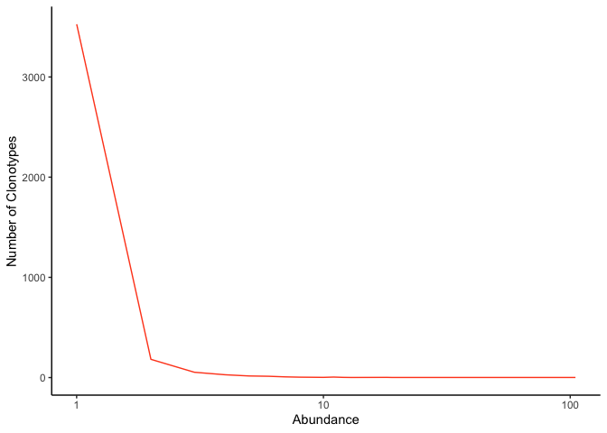
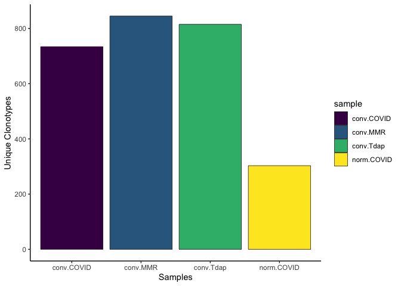
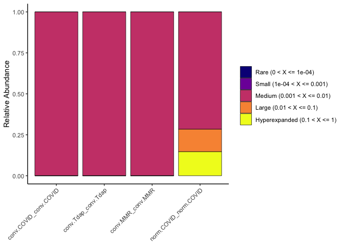
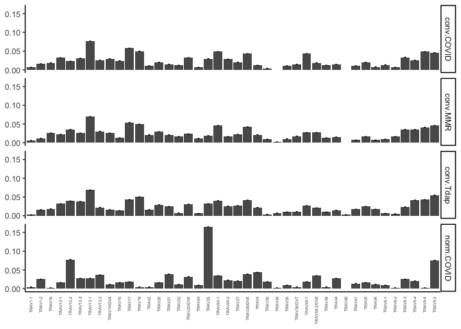

Last Updated March 23, 2022

# Single Cell V(D)J Analysis

## Packages

```r
if (!requireNamespace("BiocManager", quietly = TRUE)){
    install.packages("BiocManager")
}

if (!any(rownames(installed.packages()) == "ggplot2")){
  BiocManager::install("ggplot2")
}

if (!any(rownames(installed.packages()) == "knitr")){
  BiocManager::install("knitr")
}

if (!any(rownames(installed.packages()) == "kableExtra")){
  BiocManager::install("kableExtra")
}

if (!any(rownames(installed.packages()) == "dplyr")){
  BiocManager::install("dplyr")
}

if (!any(rownames(installed.packages()) == "tidyr")){
  BiocManager::install("tidyr")
}
if (!any(rownames(installed.packages()) == "magrittr")){
  BiocManager::install("magrittr")
}

if (!any(rownames(installed.packages()) == "scRepertoire")){
  BiocManager::install("scRepertoire")
}

library(ggplot2)
library(tidyr)
library(magrittr)
library(knitr)
library(kableExtra)
library(dplyr)
library(scRepertoire)
```

## Download Cell Ranger results

```r
options(timeout=1200)
download.file("https://raw.githubusercontent.com/ucdavis-bioinformatics-training/2022-March-Advanced-Topics-in-Single-Cell-RNA-Seq-VDJ/main/data_analysis/cellranger_vdj_results.zip", "cellranger_vdj_results.zip")
system("unzip cellranger_vdj_results.zip")
```

## Set-up

```r
experiment_name = "VDJ Example"
dataset_loc <- "./cellranger_vdj_results"
ids <- c("Pool1")
```

## Sequencing metrics

```r
metrics <- paste(dataset_loc, ids, "metrics_summary.csv", sep = "/")
metrics_table <- do.call("cbind", lapply(metrics, function(x) {
  as.data.frame(t(read.csv(x)))
  }))
colnames(metrics_table) <- ids
rownames(metrics_table) <- gsub(".", " ", rownames(metrics_table), fixed = TRUE)
metrics_table  %>%
  kable(caption = 'Cell Ranger Results') %>%
  pack_rows("Overview", 1, 3, label_row_css = "background-color: #666; color: #fff;") %>%
  pack_rows("Sequencing Characteristics", 4, 8, label_row_css = "background-color: #666; color: #fff;") %>%
  pack_rows("Mapping Characteristics", 9, 26, label_row_css = "background-color: #666; color: #fff;") %>%
  kable_styling("striped", fixed_thead = TRUE)
```

<table class="table table-striped" style="margin-left: auto; margin-right: auto;">
<caption>Cell Ranger Results</caption>
 <thead>
  <tr>
   <th style="text-align:left;position: sticky; top:0; background-color: #FFFFFF;">   </th>
   <th style="text-align:left;position: sticky; top:0; background-color: #FFFFFF;"> Pool1 </th>
  </tr>
 </thead>
<tbody>
  <tr grouplength="3"><td colspan="2" style="background-color: #666; color: #fff;"><strong>Overview</strong></td></tr>
<tr>
   <td style="text-align:left;padding-left: 2em;" indentlevel="1"> Estimated Number of Cells </td>
   <td style="text-align:left;"> 5,703 </td>
  </tr>
  <tr>
   <td style="text-align:left;padding-left: 2em;" indentlevel="1"> Mean Read Pairs per Cell </td>
   <td style="text-align:left;"> 49,067 </td>
  </tr>
  <tr>
   <td style="text-align:left;padding-left: 2em;" indentlevel="1"> Number of Cells With Productive V J Spanning Pair </td>
   <td style="text-align:left;"> 4,392 </td>
  </tr>
  <tr grouplength="5"><td colspan="2" style="background-color: #666; color: #fff;"><strong>Sequencing Characteristics</strong></td></tr>
<tr>
   <td style="text-align:left;padding-left: 2em;" indentlevel="1"> Number of Read Pairs </td>
   <td style="text-align:left;"> 279,829,164 </td>
  </tr>
  <tr>
   <td style="text-align:left;padding-left: 2em;" indentlevel="1"> Valid Barcodes </td>
   <td style="text-align:left;"> 94.4% </td>
  </tr>
  <tr>
   <td style="text-align:left;padding-left: 2em;" indentlevel="1"> Q30 Bases in Barcode </td>
   <td style="text-align:left;"> 93.8% </td>
  </tr>
  <tr>
   <td style="text-align:left;padding-left: 2em;" indentlevel="1"> Q30 Bases in RNA Read 1 </td>
   <td style="text-align:left;"> 91.6% </td>
  </tr>
  <tr>
   <td style="text-align:left;padding-left: 2em;" indentlevel="1"> Q30 Bases in UMI </td>
   <td style="text-align:left;"> 93.5% </td>
  </tr>
  <tr grouplength="18"><td colspan="2" style="background-color: #666; color: #fff;"><strong>Mapping Characteristics</strong></td></tr>
<tr>
   <td style="text-align:left;padding-left: 2em;" indentlevel="1"> Reads Mapped to Any V D J Gene </td>
   <td style="text-align:left;"> 85.8% </td>
  </tr>
  <tr>
   <td style="text-align:left;padding-left: 2em;" indentlevel="1"> Reads Mapped to TRA </td>
   <td style="text-align:left;"> 37.3% </td>
  </tr>
  <tr>
   <td style="text-align:left;padding-left: 2em;" indentlevel="1"> Reads Mapped to TRB </td>
   <td style="text-align:left;"> 48.3% </td>
  </tr>
  <tr>
   <td style="text-align:left;padding-left: 2em;" indentlevel="1"> Mean Used Read Pairs per Cell </td>
   <td style="text-align:left;"> 30,419 </td>
  </tr>
  <tr>
   <td style="text-align:left;padding-left: 2em;" indentlevel="1"> Fraction Reads in Cells </td>
   <td style="text-align:left;"> 75.0% </td>
  </tr>
  <tr>
   <td style="text-align:left;padding-left: 2em;" indentlevel="1"> Median TRA UMIs per Cell </td>
   <td style="text-align:left;"> 6 </td>
  </tr>
  <tr>
   <td style="text-align:left;padding-left: 2em;" indentlevel="1"> Median TRB UMIs per Cell </td>
   <td style="text-align:left;"> 14 </td>
  </tr>
  <tr>
   <td style="text-align:left;padding-left: 2em;" indentlevel="1"> Cells With Productive V J Spanning Pair </td>
   <td style="text-align:left;"> 77.0% </td>
  </tr>
  <tr>
   <td style="text-align:left;padding-left: 2em;" indentlevel="1"> Cells With Productive V J Spanning  TRA  TRB  Pair </td>
   <td style="text-align:left;"> 77.0% </td>
  </tr>
  <tr>
   <td style="text-align:left;padding-left: 2em;" indentlevel="1"> Paired Clonotype Diversity </td>
   <td style="text-align:left;"> 1162.31 </td>
  </tr>
  <tr>
   <td style="text-align:left;padding-left: 2em;" indentlevel="1"> Cells With TRA Contig </td>
   <td style="text-align:left;"> 90.0% </td>
  </tr>
  <tr>
   <td style="text-align:left;padding-left: 2em;" indentlevel="1"> Cells With TRB Contig </td>
   <td style="text-align:left;"> 96.1% </td>
  </tr>
  <tr>
   <td style="text-align:left;padding-left: 2em;" indentlevel="1"> Cells With CDR3 annotated TRA Contig </td>
   <td style="text-align:left;"> 87.1% </td>
  </tr>
  <tr>
   <td style="text-align:left;padding-left: 2em;" indentlevel="1"> Cells With CDR3 annotated TRB Contig </td>
   <td style="text-align:left;"> 94.4% </td>
  </tr>
  <tr>
   <td style="text-align:left;padding-left: 2em;" indentlevel="1"> Cells With V J Spanning TRA Contig </td>
   <td style="text-align:left;"> 88.8% </td>
  </tr>
  <tr>
   <td style="text-align:left;padding-left: 2em;" indentlevel="1"> Cells With V J Spanning TRB Contig </td>
   <td style="text-align:left;"> 94.7% </td>
  </tr>
  <tr>
   <td style="text-align:left;padding-left: 2em;" indentlevel="1"> Cells With Productive TRA Contig </td>
   <td style="text-align:left;"> 84.5% </td>
  </tr>
  <tr>
   <td style="text-align:left;padding-left: 2em;" indentlevel="1"> Cells With Productive TRB Contig </td>
   <td style="text-align:left;"> 92.5% </td>
  </tr>
</tbody>
</table>

The majority of the following functions and figures come from [scRepertoire](https://ncborcherding.github.io/vignettes/vignette.html). We will be exploring and making changes to the code as we go, so please take notes and don't be afraid to experiment and ask questions!

## Read in Cell Ranger VDJ Data

```r
clonotypes <- paste(dataset_loc, ids, "filtered_contig_annotations.csv", sep = "/")
vdj <- combineTCR(lapply(clonotypes, read.csv),
                  samples = ids,
                  ID = ids,
                  cells = "T-AB",
                  removeMulti = TRUE)
class(vdj)
```

```
## [1] "list"
```

```r
str(vdj)
```

```
## List of 1
##  $ Pool1_Pool1:'data.frame':	4913 obs. of  14 variables:
##   ..$ barcode : chr [1:4913] "Pool1_Pool1_AAACCTGAGCAAATCA-1" "Pool1_Pool1_AAACCTGAGCTACCTA-1" "Pool1_Pool1_AAACCTGAGTACGCGA-1" "Pool1_Pool1_AAACCTGCAGTCCTTC-1" ...
##   ..$ sample  : chr [1:4913] "Pool1" "Pool1" "Pool1" "Pool1" ...
##   ..$ ID      : chr [1:4913] "Pool1" "Pool1" "Pool1" "Pool1" ...
##   ..$ TCR1    : chr [1:4913] "TRAV12-1.TRAJ10.TRAC" "TRAV17.TRAJ9.TRAC" "TRAV6.TRAJ45.TRAC" NA ...
##   ..$ cdr3_aa1: chr [1:4913] "CVVNTGGGNKLTF" "CATDARAGGFKTIF" "CALDMAYSGGGADGLTF" NA ...
##   ..$ cdr3_nt1: chr [1:4913] "TGTGTGGTGAACACGGGAGGAGGAAACAAACTCACCTTT" "TGTGCTACGGACGCGCGGGCTGGAGGCTTCAAAACTATCTTT" "TGTGCTCTAGACATGGCGTATTCAGGAGGAGGTGCTGACGGACTCACCTTT" NA ...
##   ..$ TCR2    : chr [1:4913] "TRBV2.TRBJ2-2.None.TRBC2" "TRBV20-1.TRBJ1-4.None.TRBC1" NA "TRBV2.TRBJ2-1.None.TRBC2" ...
##   ..$ cdr3_aa2: chr [1:4913] "CASSAGTGELFF" "CSARDLGQREKLFF" NA "CASRDARDLVPQFF" ...
##   ..$ cdr3_nt2: chr [1:4913] "TGTGCCAGCAGCGCCGGGACCGGGGAGCTGTTTTTT" "TGCAGTGCTAGAGATCTGGGACAGCGTGAAAAACTGTTTTTT" NA "TGTGCCAGCAGGGATGCCCGGGACCTCGTCCCGCAGTTCTTC" ...
##   ..$ CTgene  : chr [1:4913] "TRAV12-1.TRAJ10.TRAC_TRBV2.TRBJ2-2.None.TRBC2" "TRAV17.TRAJ9.TRAC_TRBV20-1.TRBJ1-4.None.TRBC1" "TRAV6.TRAJ45.TRAC_NA" "NA_TRBV2.TRBJ2-1.None.TRBC2" ...
##   ..$ CTnt    : chr [1:4913] "TGTGTGGTGAACACGGGAGGAGGAAACAAACTCACCTTT_TGTGCCAGCAGCGCCGGGACCGGGGAGCTGTTTTTT" "TGTGCTACGGACGCGCGGGCTGGAGGCTTCAAAACTATCTTT_TGCAGTGCTAGAGATCTGGGACAGCGTGAAAAACTGTTTTTT" "TGTGCTCTAGACATGGCGTATTCAGGAGGAGGTGCTGACGGACTCACCTTT_NA" "NA_TGTGCCAGCAGGGATGCCCGGGACCTCGTCCCGCAGTTCTTC" ...
##   ..$ CTaa    : chr [1:4913] "CVVNTGGGNKLTF_CASSAGTGELFF" "CATDARAGGFKTIF_CSARDLGQREKLFF" "CALDMAYSGGGADGLTF_NA" "NA_CASRDARDLVPQFF" ...
##   ..$ CTstrict: chr [1:4913] "TRAV12-1.TRAJ10.TRAC_TGTGTGGTGAACACGGGAGGAGGAAACAAACTCACCTTT_TRBV2.TRBJ2-2.None.TRBC2_TGTGCCAGCAGCGCCGGGACCGGGGAGCTGTTTTTT" "TRAV17.TRAJ9.TRAC_TGTGCTACGGACGCGCGGGCTGGAGGCTTCAAAACTATCTTT_TRBV20-1.TRBJ1-4.None.TRBC1_TGCAGTGCTAGAGATCTGGGAC"| __truncated__ "TRAV6.TRAJ45.TRAC_TGTGCTCTAGACATGGCGTATTCAGGAGGAGGTGCTGACGGACTCACCTTT_NA_NA" "NA_NA_TRBV2.TRBJ2-1.None.TRBC2_TGTGCCAGCAGGGATGCCCGGGACCTCGTCCCGCAGTTCTTC" ...
##   ..$ cellType: chr [1:4913] "T-AB" "T-AB" "T-AB" "T-AB" ...
```

```r
class(vdj[[1]])
```

```
## [1] "data.frame"
```

```r
head(vdj[[1]])
```

```
##                          barcode sample    ID                 TCR1
## 1 Pool1_Pool1_AAACCTGAGCAAATCA-1  Pool1 Pool1 TRAV12-1.TRAJ10.TRAC
## 2 Pool1_Pool1_AAACCTGAGCTACCTA-1  Pool1 Pool1    TRAV17.TRAJ9.TRAC
## 3 Pool1_Pool1_AAACCTGAGTACGCGA-1  Pool1 Pool1    TRAV6.TRAJ45.TRAC
## 4 Pool1_Pool1_AAACCTGCAGTCCTTC-1  Pool1 Pool1                 <NA>
## 5 Pool1_Pool1_AAACCTGCATCCCATC-1  Pool1 Pool1 TRAV13-2.TRAJ30.TRAC
## 6 Pool1_Pool1_AAACCTGGTAAATGTG-1  Pool1 Pool1                 <NA>
##            cdr3_aa1                                            cdr3_nt1
## 1     CVVNTGGGNKLTF             TGTGTGGTGAACACGGGAGGAGGAAACAAACTCACCTTT
## 2    CATDARAGGFKTIF          TGTGCTACGGACGCGCGGGCTGGAGGCTTCAAAACTATCTTT
## 3 CALDMAYSGGGADGLTF TGTGCTCTAGACATGGCGTATTCAGGAGGAGGTGCTGACGGACTCACCTTT
## 4              <NA>                                                <NA>
## 5       CAENRDDKIIF                   TGTGCAGAGAACAGAGATGACAAGATCATCTTT
## 6              <NA>                                                <NA>
##                          TCR2         cdr3_aa2
## 1    TRBV2.TRBJ2-2.None.TRBC2     CASSAGTGELFF
## 2 TRBV20-1.TRBJ1-4.None.TRBC1   CSARDLGQREKLFF
## 3                        <NA>             <NA>
## 4    TRBV2.TRBJ2-1.None.TRBC2   CASRDARDLVPQFF
## 5   TRBV19.TRBJ1-1.None.TRBC1  CASTFSDSGGTEAFF
## 6  TRBV6-2.TRBJ2-5.None.TRBC2 CASSRPQGAVQETQYF
##                                           cdr3_nt2
## 1             TGTGCCAGCAGCGCCGGGACCGGGGAGCTGTTTTTT
## 2       TGCAGTGCTAGAGATCTGGGACAGCGTGAAAAACTGTTTTTT
## 3                                             <NA>
## 4       TGTGCCAGCAGGGATGCCCGGGACCTCGTCCCGCAGTTCTTC
## 5    TGTGCCAGTACTTTCTCTGACTCGGGCGGCACTGAAGCTTTCTTT
## 6 TGTGCCAGCAGTAGACCACAGGGGGCGGTCCAAGAGACCCAGTACTTC
##                                           CTgene
## 1  TRAV12-1.TRAJ10.TRAC_TRBV2.TRBJ2-2.None.TRBC2
## 2  TRAV17.TRAJ9.TRAC_TRBV20-1.TRBJ1-4.None.TRBC1
## 3                           TRAV6.TRAJ45.TRAC_NA
## 4                    NA_TRBV2.TRBJ2-1.None.TRBC2
## 5 TRAV13-2.TRAJ30.TRAC_TRBV19.TRBJ1-1.None.TRBC1
## 6                  NA_TRBV6-2.TRBJ2-5.None.TRBC2
##                                                                                    CTnt
## 1          TGTGTGGTGAACACGGGAGGAGGAAACAAACTCACCTTT_TGTGCCAGCAGCGCCGGGACCGGGGAGCTGTTTTTT
## 2 TGTGCTACGGACGCGCGGGCTGGAGGCTTCAAAACTATCTTT_TGCAGTGCTAGAGATCTGGGACAGCGTGAAAAACTGTTTTTT
## 3                                TGTGCTCTAGACATGGCGTATTCAGGAGGAGGTGCTGACGGACTCACCTTT_NA
## 4                                         NA_TGTGCCAGCAGGGATGCCCGGGACCTCGTCCCGCAGTTCTTC
## 5       TGTGCAGAGAACAGAGATGACAAGATCATCTTT_TGTGCCAGTACTTTCTCTGACTCGGGCGGCACTGAAGCTTTCTTT
## 6                                   NA_TGTGCCAGCAGTAGACCACAGGGGGCGGTCCAAGAGACCCAGTACTTC
##                            CTaa
## 1    CVVNTGGGNKLTF_CASSAGTGELFF
## 2 CATDARAGGFKTIF_CSARDLGQREKLFF
## 3          CALDMAYSGGGADGLTF_NA
## 4             NA_CASRDARDLVPQFF
## 5   CAENRDDKIIF_CASTFSDSGGTEAFF
## 6           NA_CASSRPQGAVQETQYF
##                                                                                                                              CTstrict
## 1          TRAV12-1.TRAJ10.TRAC_TGTGTGGTGAACACGGGAGGAGGAAACAAACTCACCTTT_TRBV2.TRBJ2-2.None.TRBC2_TGTGCCAGCAGCGCCGGGACCGGGGAGCTGTTTTTT
## 2 TRAV17.TRAJ9.TRAC_TGTGCTACGGACGCGCGGGCTGGAGGCTTCAAAACTATCTTT_TRBV20-1.TRBJ1-4.None.TRBC1_TGCAGTGCTAGAGATCTGGGACAGCGTGAAAAACTGTTTTTT
## 3                                                         TRAV6.TRAJ45.TRAC_TGTGCTCTAGACATGGCGTATTCAGGAGGAGGTGCTGACGGACTCACCTTT_NA_NA
## 4                                                           NA_NA_TRBV2.TRBJ2-1.None.TRBC2_TGTGCCAGCAGGGATGCCCGGGACCTCGTCCCGCAGTTCTTC
## 5      TRAV13-2.TRAJ30.TRAC_TGTGCAGAGAACAGAGATGACAAGATCATCTTT_TRBV19.TRBJ1-1.None.TRBC1_TGTGCCAGTACTTTCTCTGACTCGGGCGGCACTGAAGCTTTCTTT
## 6                                                   NA_NA_TRBV6-2.TRBJ2-5.None.TRBC2_TGTGCCAGCAGTAGACCACAGGGGGCGGTCCAAGAGACCCAGTACTTC
##   cellType
## 1     T-AB
## 2     T-AB
## 3     T-AB
## 4     T-AB
## 5     T-AB
## 6     T-AB
```

## Number of unique clonotypes

```r
quantContig(vdj, cloneCall="aa", group = "sample", scale = FALSE)
```

<!-- -->
## Distribution of clonotypes by abundance

```r
abundanceContig(vdj, cloneCall = "gene", group = "sample", scale = FALSE)
```

<!-- -->

## Contig length distribution

```r
lengthContig(vdj, cloneCall="nt", scale=TRUE, chains = "combined", group="sample")
```

<!-- -->

```r
lengthContig(vdj, cloneCall="aa", chains = "single", group = "sample")
```

<!-- -->

### Shared clonotypes

This function does not make much sense with only one sample, and is included just for the purposes of demonstration.


```r
compareClonotypes(vdj, numbers = 10, cloneCall = "aa", graph = "alluvial") +
  theme(axis.text.x = element_text(angle = 45, hjust = 1)) +
  labs(caption = "Results of compareClonotypes() with numbers = 10.")
```

<!-- -->

### Relative abundance of clones by frequency

```r
clonalHomeostasis(vdj, cloneCall = "aa") +
  theme(axis.text.x = element_text(angle = 45, hjust = 1))
```

<!-- -->

### Relative abundance of clones by index

Clonal index 1 represents the most frequent clone in a given sample, while index 1000 represents the 1000th most frequent clone.

```r
clonalProportion(vdj, cloneCall = "aa", split = c(10, 50, 100, 500, 1000)) +
  theme(axis.text.x = element_text(angle = 45, hjust = 1))
```

<!-- -->

### Overlap analysis

Clonal overlap is scaled to the number of unique clonotypes in the smaller sample. This code errors on fewer than two samples.

```r
clonalOverlap(vdj, cloneCall = "gene+nt")
```

## Clonal diversity

```r
clonalDiversity(vdj, cloneCall = "aa", group = "samples")
```

<!-- -->

## TCR clustering

This is slow. I suggest skipping it for now so that you don't get stuck at this point.

```r
tcr.clusters <- clusterTCR(vdj[[1]], chain = "TCRA", sequence = "aa", threshold = 0.9)
```

## Combine V(D)J and expression data

In the terminal, from your project directory, run `scp username@tadpole.genomecenter.ucdavis.edu:/share/workshop/vdj_workshop/R_objects/seurat_object.rds .`.


```r
library(Seurat)
```

```
## Attaching SeuratObject
```

```r
expression <- readRDS("seurat_object.rds")
expression$barcode <- sapply(strsplit(colnames(expression), split = "-"), "[[", 1)
expression <- RenameCells(expression, new.names = expression$barcode)
vdj <- lapply(vdj, function (x) {
  b = sapply(strsplit(sapply(strsplit(x$barcode, split = "_"), "[[", 3), split = "-"), "[[", 1)
  x$barcode = b
  x
  })
expression <- combineExpression(vdj, expression, cloneCall="gene")
head(expression@meta.data)
```

```
##                  orig.ident nCount_RNA nFeature_RNA percent.mito     S.Score
## AAACCTGCAGACTCGC conv_COVID       7321         2560    0.3824614 -0.04879952
## AAACGGGTCTGGGCCA conv_COVID       6765         2128    0.8869180 -0.01441873
## AAACGGGTCTTAGAGC conv_COVID      11471         2964    0.4794700 -0.05208459
## AAAGATGCATCCTAGA conv_COVID       9610         2605    0.9261186 -0.02179640
## AAAGCAAAGAGTAAGG conv_COVID       7242         2051    0.3314002  0.11342246
## AAAGCAAAGCCTATGT conv_COVID       1016          772    1.6732283  0.03533120
##                     G2M.Score Phase  old.ident RNA_snn_res.0.25
## AAACCTGCAGACTCGC -0.026197357    G1 conv_COVID                6
## AAACGGGTCTGGGCCA -0.031983183    G1 conv_COVID                0
## AAACGGGTCTTAGAGC -0.003787519    G1 conv_COVID                0
## AAAGATGCATCCTAGA -0.011175856    G1 conv_COVID                6
## AAAGCAAAGAGTAAGG  0.019373865     S conv_COVID                2
## AAAGCAAAGCCTATGT -0.017761709     S conv_COVID                5
##                  RNA_snn_res.0.75 RNA_snn_res.1.25 RNA_snn_res.1.75
## AAACCTGCAGACTCGC                8                8                9
## AAACGGGTCTGGGCCA                0                0                3
## AAACGGGTCTTAGAGC                0                0                3
## AAAGATGCATCCTAGA                8                8                9
## AAAGCAAAGAGTAAGG                2                2                1
## AAAGCAAAGCCTATGT                7                7                5
##                  RNA_snn_res.2.25 RNA_snn_res.2.75 RNA_snn_res.3.25
## AAACCTGCAGACTCGC                8                6                6
## AAACGGGTCTGGGCCA                1               13               10
## AAACGGGTCTTAGAGC                1                1               10
## AAAGATGCATCCTAGA                8                6                6
## AAAGCAAAGAGTAAGG                3                2                1
## AAAGCAAAGCCTATGT                7                5                4
##                  RNA_snn_res.3.75 seurat_clusters finalcluster samplecluster
## AAACCTGCAGACTCGC                6               6            8  conv_COVID-8
## AAACGGGTCTGGGCCA               11              11            0  conv_COVID-0
## AAACGGGTCTTAGAGC               11              11            0  conv_COVID-0
## AAAGATGCATCCTAGA                6               6            8  conv_COVID-8
## AAAGCAAAGAGTAAGG                0               0            2  conv_COVID-2
## AAAGCAAAGCCTATGT                5               5            7  conv_COVID-7
##                           barcode
## AAACCTGCAGACTCGC             <NA>
## AAACGGGTCTGGGCCA             <NA>
## AAACGGGTCTTAGAGC AAACGGGTCTTAGAGC
## AAAGATGCATCCTAGA AAAGATGCATCCTAGA
## AAAGCAAAGAGTAAGG AAAGCAAAGAGTAAGG
## AAAGCAAAGCCTATGT             <NA>
##                                                              CTgene
## AAACCTGCAGACTCGC                                               <NA>
## AAACGGGTCTGGGCCA                                               <NA>
## AAACGGGTCTTAGAGC       TRAV5.TRAJ29.TRAC_TRBV7-2.TRBJ1-6.None.TRBC1
## AAAGATGCATCCTAGA TRAV14/DV4.TRAJ34.TRAC_TRBV24-1.TRBJ2-1.None.TRBC2
## AAAGCAAAGAGTAAGG                     NA_TRBV10-3.TRBJ1-5.None.TRBC1
## AAAGCAAAGCCTATGT                                               <NA>
##                                                                                                         CTnt
## AAACCTGCAGACTCGC                                                                                        <NA>
## AAACGGGTCTGGGCCA                                                                                        <NA>
## AAACGGGTCTTAGAGC          TGTGCAGAGAAAGGGGAAACACCTCTTGTCTTT_TGTGCCAGCAGCTTAGCGGGAGAGGGTAATAATTCACCCCTCCACTTT
## AAAGATGCATCCTAGA TGTGCAATGAGAGCCGACCCTTATAACACCGACAAGCTCATCTTT_TGTGCCACCGGGGGGAGGGCCGGGACCTACAATGAGCAGTTCTTC
## AAAGCAAAGAGTAAGG                                                     NA_TGTGCCATCAGTGAGAGGGGTCAGCCCCAGCATTTT
## AAAGCAAAGCCTATGT                                                                                        <NA>
##                                             CTaa
## AAACCTGCAGACTCGC                            <NA>
## AAACGGGTCTGGGCCA                            <NA>
## AAACGGGTCTTAGAGC    CAEKGETPLVF_CASSLAGEGNNSPLHF
## AAAGATGCATCCTAGA CAMRADPYNTDKLIF_CATGGRAGTYNEQFF
## AAAGCAAAGAGTAAGG                 NA_CAISERGQPQHF
## AAAGCAAAGCCTATGT                            <NA>
##                                                                                                                                                        CTstrict
## AAACCTGCAGACTCGC                                                                                                                                           <NA>
## AAACGGGTCTGGGCCA                                                                                                                                           <NA>
## AAACGGGTCTTAGAGC                TRAV5.TRAJ29.TRAC_TGTGCAGAGAAAGGGGAAACACCTCTTGTCTTT_TRBV7-2.TRBJ1-6.None.TRBC1_TGTGCCAGCAGCTTAGCGGGAGAGGGTAATAATTCACCCCTCCACTTT
## AAAGATGCATCCTAGA TRAV14/DV4.TRAJ34.TRAC_TGTGCAATGAGAGCCGACCCTTATAACACCGACAAGCTCATCTTT_TRBV24-1.TRBJ2-1.None.TRBC2_TGTGCCACCGGGGGGAGGGCCGGGACCTACAATGAGCAGTTCTTC
## AAAGCAAAGAGTAAGG                                                                         NA_NA_TRBV10-3.TRBJ1-5.None.TRBC1_TGTGCCATCAGTGAGAGGGGTCAGCCCCAGCATTTT
## AAAGCAAAGCCTATGT                                                                                                                                           <NA>
##                     Frequency                  cloneType
## AAACCTGCAGACTCGC           NA                       <NA>
## AAACGGGTCTGGGCCA           NA                       <NA>
## AAACGGGTCTTAGAGC 0.0004128819 Small (1e-04 < X <= 0.001)
## AAAGATGCATCCTAGA 0.0004128819 Small (1e-04 < X <= 0.001)
## AAAGCAAAGAGTAAGG 0.0008257638 Small (1e-04 < X <= 0.001)
## AAAGCAAAGCCTATGT           NA                       <NA>
```
### Find markers for "large" clones

```r
DimPlot(expression, group.by = "cloneType")
```

<!-- -->

```r
Idents(expression) <- "cloneType"
large.markers <-FindMarkers(expression, ident.1 = "Large (0.01 < X <= 0.1)")
head(large.markers)
```

```
##                 p_val avg_log2FC pct.1 pct.2     p_val_adj
## TRAV25  3.144420e-188   2.577545 0.591 0.027 1.150889e-183
## TRBV6-5 2.415113e-176   3.507570 0.787 0.067 8.839557e-172
## GZMH    1.530561e-173   3.002632 0.874 0.087 5.602005e-169
## FGFBP2  3.202763e-154   2.845364 0.795 0.078 1.172243e-149
## CCL5    2.263650e-116   2.910292 0.961 0.181 8.285185e-112
## CST7     1.057213e-80   2.082753 0.827 0.182  3.869504e-76
```

```r
Idents(expression) <- "orig.ident"
```

### Split V(D)J data into separate samples and re-run scRepertoire functions

```r
vdj <- expression2List(expression, group = "orig.ident")
quantContig(vdj, cloneCall="aa", scale = FALSE)
```

<!-- -->

```r
abundanceContig(vdj, cloneCall = "gene", scale = FALSE)
```

<!-- -->

```r
compareClonotypes(vdj, numbers = 20, cloneCall = "aa", graph = "alluvial") +
  guides(fill = "none") +
  theme(axis.text.x = element_text(angle = 45, hjust = 1)) +
  labs(caption = "Results of compareClonotypes() with numbers = 20.")
```

<!-- -->

```r
clonalHomeostasis(vdj, cloneCall = "aa") +
  theme(axis.text.x = element_text(angle = 45, hjust = 1))
```

<!-- -->

```r
clonalProportion(vdj, cloneCall = "aa", split = c(10, 50, 100, 500, 1000)) +
  theme(axis.text.x = element_text(angle = 45, hjust = 1))
```

<!-- -->

```r
clonalOverlap(vdj, cloneCall = "gene+nt")
```

```
## Warning in if (method == "overlap") {: the condition has length > 1 and only the
## first element will be used
```

```
## Warning: Removed 6 rows containing missing values (geom_text).
```

<!-- -->

```r
clonalDiversity(vdj, cloneCall = "aa")
```

<!-- -->

```r
?clonalOverlay
clonalOverlay(expression, reduction = "umap", freq.cutpoint = 30, bins = 10, facet = "orig.ident")
```

<!-- -->

```r
contig <- abundanceContig(vdj, exportTable = TRUE) %>%
  arrange(desc(Abundance)) %>%
  slice(5)
contig$CTstrict
```

```
## [1] "TRAV25.TRAJ37.TRAC_TGTGCAGGTCCCCGGGGCTCTGGCAACACAGGCAAACTAATCTTT_TRBV6-5.TRBJ1-1.None.TRBC1_TGTGCCAGCAGAAAACAGGGGGCCACTGAAGCTTTCTTT"
```

```r
DimPlot(highlightClonotypes(expression, cloneCall = "gene+nt", sequence = "TRAV25.TRAJ37.TRAC_TGTGCAGGTCCCCGGGGCTCTGGCAACACAGGCAAACTAATCTTT_TRBV6-5.TRBJ1-1.None.TRBC1_TGTGCCAGCAGAAAACAGGGGGCCACTGAAGCTTTCTTT"), group.by = "highlight")
```

<!-- -->

## Circos plots

This code is under construction! If we have time, I will attempt to update this and run it.


```r
?getCirclize
circles <- getCirclize(vdj, groupBy = "orig.ident" )

#Just assigning the normal colors to each cluster
grid.cols <- hue_pal()(length(unique(seurat$orig.ident)))
names(grid.cols) <- levels(seurat$orig.ident)

#Graphing the chord diagram
chordDiagram(circles, self.link = 1, grid.col = grid.cols)

data_to_circlize <- experiment.aggregate[[]][experiment.aggregate$RNA_snn_res.0.75 %in% b_cells & !is.na(experiment.aggregate$CTgene),]
dim(data_to_circlize)
head(data_to_circlize)

aa_seqs <- strsplit(as.character(unlist(data_to_circlize$CTaa)),split="_")
table(sapply(aa_seqs, length))
data_to_circlize$A_chain = sapply(aa_seqs, "[[", 1L)
data_to_circlize$B_chain = sapply(aa_seqs, "[[", 2L)

data_to_circlize$IGH = sapply(strsplit(data_to_circlize$CTstrict, split="_"), function(x) paste(unique(x[c(1)]),collapse="_"))
data_to_circlize$IGL = sapply(strsplit(data_to_circlize$CTstrict, split="_"), function(x) paste(unique(x[c(3)]),collapse="_"))
                              
# get optimal sequence order from trivial plot
chordDiagram(data.frame(data_to_circlize$IGH[1:15], data_to_circlize$IGL[1:15], times = 1), annotationTrack = "grid" )
seq.order <- get.all.sector.index()
circos.clear()
```

## Session Information

```r
sessionInfo()
```

```
## R version 4.1.2 (2021-11-01)
## Platform: aarch64-apple-darwin20 (64-bit)
## Running under: macOS Monterey 12.0.1
## 
## Matrix products: default
## BLAS:   /Library/Frameworks/R.framework/Versions/4.1-arm64/Resources/lib/libRblas.0.dylib
## LAPACK: /Library/Frameworks/R.framework/Versions/4.1-arm64/Resources/lib/libRlapack.dylib
## 
## locale:
## [1] en_US.UTF-8/en_US.UTF-8/en_US.UTF-8/C/en_US.UTF-8/en_US.UTF-8
## 
## attached base packages:
## [1] stats     graphics  grDevices utils     datasets  methods   base     
## 
## other attached packages:
## [1] SeuratObject_4.0.4 Seurat_4.1.0       scRepertoire_1.4.0 dplyr_1.0.8       
## [5] kableExtra_1.3.4   knitr_1.37         magrittr_2.0.2     tidyr_1.2.0       
## [9] ggplot2_3.3.5     
## 
## loaded via a namespace (and not attached):
##   [1] VGAM_1.1-6                  systemfonts_1.0.4          
##   [3] plyr_1.8.6                  igraph_1.2.11              
##   [5] lazyeval_0.2.2              splines_4.1.2              
##   [7] powerTCR_1.14.0             listenv_0.8.0              
##   [9] scattermore_0.8             GenomeInfoDb_1.30.1        
##  [11] digest_0.6.29               foreach_1.5.2              
##  [13] htmltools_0.5.2             ggalluvial_0.12.3          
##  [15] fansi_1.0.2                 truncdist_1.0-2            
##  [17] tensor_1.5                  cluster_2.1.2              
##  [19] doParallel_1.0.17           ROCR_1.0-11                
##  [21] limma_3.50.1                globals_0.14.0             
##  [23] matrixStats_0.61.0          svglite_2.1.0              
##  [25] spatstat.sparse_2.1-0       colorspace_2.0-3           
##  [27] rvest_1.0.2                 ggrepel_0.9.1              
##  [29] xfun_0.30                   crayon_1.5.0               
##  [31] RCurl_1.98-1.6              jsonlite_1.8.0             
##  [33] spatstat.data_2.1-2         survival_3.3-1             
##  [35] zoo_1.8-9                   iterators_1.0.14           
##  [37] glue_1.6.2                  polyclip_1.10-0            
##  [39] gtable_0.3.0                zlibbioc_1.40.0            
##  [41] XVector_0.34.0              webshot_0.5.2              
##  [43] leiden_0.3.9                DelayedArray_0.20.0        
##  [45] evd_2.3-4                   future.apply_1.8.1         
##  [47] BiocGenerics_0.40.0         abind_1.4-5                
##  [49] SparseM_1.81                scales_1.1.1               
##  [51] DBI_1.1.2                   spatstat.random_2.1-0      
##  [53] miniUI_0.1.1.1              Rcpp_1.0.8.3               
##  [55] xtable_1.8-4                viridisLite_0.4.0          
##  [57] spatstat.core_2.4-0         reticulate_1.24            
##  [59] stats4_4.1.2                htmlwidgets_1.5.4          
##  [61] httr_1.4.2                  RColorBrewer_1.1-2         
##  [63] ellipsis_0.3.2              ica_1.0-2                  
##  [65] pkgconfig_2.0.3             farver_2.1.0               
##  [67] uwot_0.1.11                 deldir_1.0-6               
##  [69] sass_0.4.0                  utf8_1.2.2                 
##  [71] tidyselect_1.1.2            labeling_0.4.2             
##  [73] rlang_1.0.2                 reshape2_1.4.4             
##  [75] later_1.3.0                 munsell_0.5.0              
##  [77] tools_4.1.2                 cli_3.2.0                  
##  [79] generics_0.1.2              ggridges_0.5.3             
##  [81] evaluate_0.15               stringr_1.4.0              
##  [83] fastmap_1.1.0               goftest_1.2-3              
##  [85] yaml_2.3.5                  evmix_2.12                 
##  [87] fitdistrplus_1.1-8          purrr_0.3.4                
##  [89] RANN_2.6.1                  pbapply_1.5-0              
##  [91] future_1.24.0               nlme_3.1-155               
##  [93] mime_0.12                   xml2_1.3.3                 
##  [95] compiler_4.1.2              rstudioapi_0.13            
##  [97] plotly_4.10.0               png_0.1-7                  
##  [99] spatstat.utils_2.3-0        tibble_3.1.6               
## [101] bslib_0.3.1                 stringi_1.7.6              
## [103] gsl_2.1-7.1                 highr_0.9                  
## [105] cubature_2.0.4.2            lattice_0.20-45            
## [107] Matrix_1.4-0                vegan_2.5-7                
## [109] permute_0.9-7               vctrs_0.3.8                
## [111] stringdist_0.9.8            pillar_1.7.0               
## [113] lifecycle_1.0.1             BiocManager_1.30.16        
## [115] spatstat.geom_2.3-2         lmtest_0.9-40              
## [117] jquerylib_0.1.4             RcppAnnoy_0.0.19           
## [119] data.table_1.14.2           cowplot_1.1.1              
## [121] bitops_1.0-7                irlba_2.3.5                
## [123] patchwork_1.1.1             httpuv_1.6.5               
## [125] GenomicRanges_1.46.1        R6_2.5.1                   
## [127] promises_1.2.0.1            gridExtra_2.3              
## [129] KernSmooth_2.23-20          IRanges_2.28.0             
## [131] parallelly_1.30.0           codetools_0.2-18           
## [133] MASS_7.3-55                 assertthat_0.2.1           
## [135] SummarizedExperiment_1.24.0 withr_2.5.0                
## [137] sctransform_0.3.3           S4Vectors_0.32.3           
## [139] GenomeInfoDbData_1.2.7      mgcv_1.8-39                
## [141] parallel_4.1.2              rpart_4.1.16               
## [143] grid_4.1.2                  rmarkdown_2.13             
## [145] MatrixGenerics_1.6.0        Rtsne_0.15                 
## [147] Biobase_2.54.0              shiny_1.7.1
```

