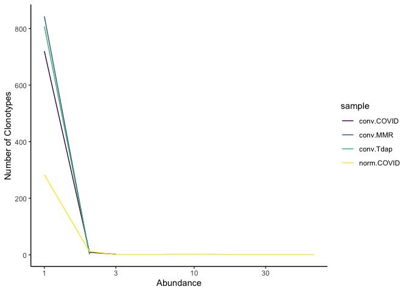
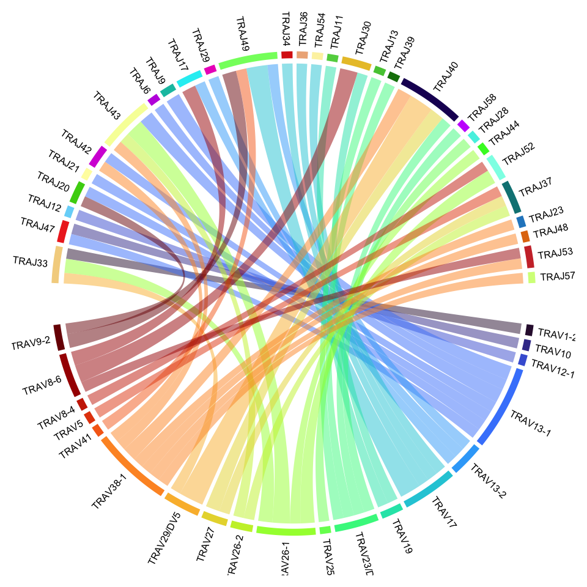
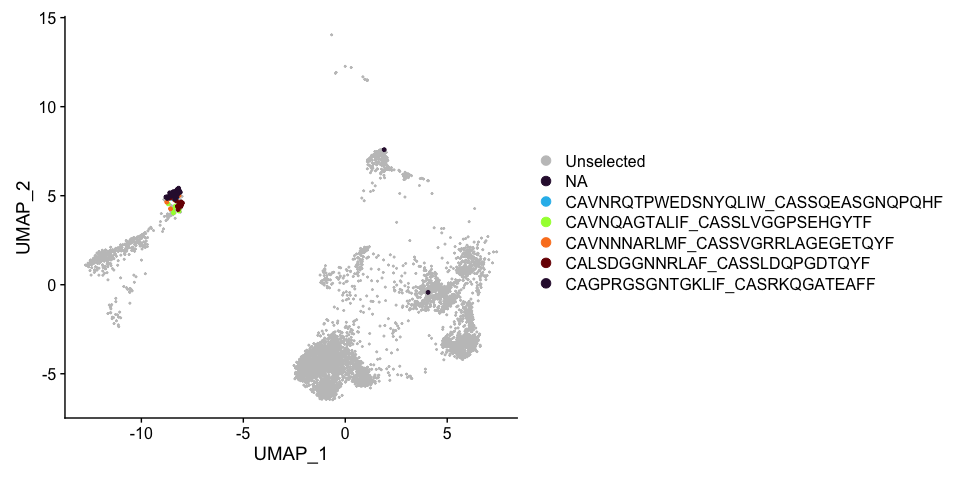

Last Updated June 27, 2023


# Single Cell V(D)J Analysis

## Libraries

```r
if (!requireNamespace("BiocManager", quietly = TRUE)){
    install.packages("BiocManager")
}

if (!any(rownames(installed.packages()) == "ggplot2")){
  BiocManager::install("ggplot2")
}

if (!any(rownames(installed.packages()) == "viridis")){
  BiocManager::install("virids")
}

if (!any(rownames(installed.packages()) == "knitr")){
  BiocManager::install("knitr")
}

if (!any(rownames(installed.packages()) == "kableExtra")){
  BiocManager::install("kableExtra")
}

if (!any(rownames(installed.packages()) == "dplyr")){
  BiocManager::install("dplyr")
}

if (!any(rownames(installed.packages()) == "tidyr")){
  BiocManager::install("tidyr")
}

if (!any(rownames(installed.packages()) == "magrittr")){
  BiocManager::install("magrittr")
}

if (!any(rownames(installed.packages()) == "scRepertoire")){
  BiocManager::install("scRepertoire")
}

if (!any(rownames(installed.packages()) == "circlize")){
  BiocManager::install("circlize")
}

library(ggplot2)
library(viridis)
library(tidyr)
library(magrittr)
library(knitr)
library(kableExtra)
library(dplyr)
library(scRepertoire)
library(Seurat)
library(circlize)

set.seed(1234) # arbitrary
```

## Download Cell Ranger results

The following code downloads the output from a cellranger vdj run that has been stored in the github repository. The system call does not work on all operating systems. If the system call fails, you may need to unzip the file manually.


```r
options(timeout=1200)
download.file("https://raw.githubusercontent.com/ucdavis-bioinformatics-training/2023-June-Advanced-Topics-in-Single-Cell-RNA-Seq-VDJ/main/data_analysis/cellranger_vdj_results.zip", "cellranger_vdj_results.zip")
system("unzip cellranger_vdj_results.zip")
```

We will also be using the gene expression data from this experiment, which is contained in a Seurat object. Download the Seurat object from the computing cluster. Don't forget to replace "username" with your username.


```bash
scp username@tadpole.genomecenter.ucdavis.edu:/share/workshop/vdj_workshop/R_objects/seurat_object.rds .
```

## Set up

```r
vdj.location <- "./cellranger_vdj_results"
vdj.ids <- c("Pool1")
```

## Sequencing metrics

```r
metrics <- paste(vdj.location, vdj.ids, "metrics_summary.csv", sep = "/")
metrics.table <- do.call("cbind", lapply(metrics, function(x) {
  as.data.frame(t(read.csv(x)))
  }))
colnames(metrics.table) <- vdj.ids
rownames(metrics.table) <- gsub(".", " ", rownames(metrics.table), fixed = TRUE)
metrics.table  %>%
  kable(caption = 'Cell Ranger Results') %>%
  pack_rows("Overview", 1, 3, label_row_css = "background-color: #666; color: #fff;") %>%
  pack_rows("Sequencing Characteristics", 4, 8, label_row_css = "background-color: #666; color: #fff;") %>%
  pack_rows("Mapping Characteristics", 9, 26, label_row_css = "background-color: #666; color: #fff;") %>%
  kable_styling("striped", fixed_thead = TRUE)
```

<table class="table table-striped" style="margin-left: auto; margin-right: auto;">
<caption>Cell Ranger Results</caption>
 <thead>
  <tr>
   <th style="text-align:left;position: sticky; top:0; background-color: #FFFFFF;">   </th>
   <th style="text-align:left;position: sticky; top:0; background-color: #FFFFFF;"> Pool1 </th>
  </tr>
 </thead>
<tbody>
  <tr grouplength="3"><td colspan="2" style="background-color: #666; color: #fff;"><strong>Overview</strong></td></tr>
<tr>
   <td style="text-align:left;padding-left: 2em;" indentlevel="1"> Estimated Number of Cells </td>
   <td style="text-align:left;"> 5,703 </td>
  </tr>
  <tr>
   <td style="text-align:left;padding-left: 2em;" indentlevel="1"> Mean Read Pairs per Cell </td>
   <td style="text-align:left;"> 49,067 </td>
  </tr>
  <tr>
   <td style="text-align:left;padding-left: 2em;" indentlevel="1"> Number of Cells With Productive V J Spanning Pair </td>
   <td style="text-align:left;"> 4,392 </td>
  </tr>
  <tr grouplength="5"><td colspan="2" style="background-color: #666; color: #fff;"><strong>Sequencing Characteristics</strong></td></tr>
<tr>
   <td style="text-align:left;padding-left: 2em;" indentlevel="1"> Number of Read Pairs </td>
   <td style="text-align:left;"> 279,829,164 </td>
  </tr>
  <tr>
   <td style="text-align:left;padding-left: 2em;" indentlevel="1"> Valid Barcodes </td>
   <td style="text-align:left;"> 94.4% </td>
  </tr>
  <tr>
   <td style="text-align:left;padding-left: 2em;" indentlevel="1"> Q30 Bases in Barcode </td>
   <td style="text-align:left;"> 93.8% </td>
  </tr>
  <tr>
   <td style="text-align:left;padding-left: 2em;" indentlevel="1"> Q30 Bases in RNA Read 1 </td>
   <td style="text-align:left;"> 91.6% </td>
  </tr>
  <tr>
   <td style="text-align:left;padding-left: 2em;" indentlevel="1"> Q30 Bases in UMI </td>
   <td style="text-align:left;"> 93.5% </td>
  </tr>
  <tr grouplength="18"><td colspan="2" style="background-color: #666; color: #fff;"><strong>Mapping Characteristics</strong></td></tr>
<tr>
   <td style="text-align:left;padding-left: 2em;" indentlevel="1"> Reads Mapped to Any V D J Gene </td>
   <td style="text-align:left;"> 85.8% </td>
  </tr>
  <tr>
   <td style="text-align:left;padding-left: 2em;" indentlevel="1"> Reads Mapped to TRA </td>
   <td style="text-align:left;"> 37.3% </td>
  </tr>
  <tr>
   <td style="text-align:left;padding-left: 2em;" indentlevel="1"> Reads Mapped to TRB </td>
   <td style="text-align:left;"> 48.3% </td>
  </tr>
  <tr>
   <td style="text-align:left;padding-left: 2em;" indentlevel="1"> Mean Used Read Pairs per Cell </td>
   <td style="text-align:left;"> 30,419 </td>
  </tr>
  <tr>
   <td style="text-align:left;padding-left: 2em;" indentlevel="1"> Fraction Reads in Cells </td>
   <td style="text-align:left;"> 75.0% </td>
  </tr>
  <tr>
   <td style="text-align:left;padding-left: 2em;" indentlevel="1"> Median TRA UMIs per Cell </td>
   <td style="text-align:left;"> 6 </td>
  </tr>
  <tr>
   <td style="text-align:left;padding-left: 2em;" indentlevel="1"> Median TRB UMIs per Cell </td>
   <td style="text-align:left;"> 14 </td>
  </tr>
  <tr>
   <td style="text-align:left;padding-left: 2em;" indentlevel="1"> Cells With Productive V J Spanning Pair </td>
   <td style="text-align:left;"> 77.0% </td>
  </tr>
  <tr>
   <td style="text-align:left;padding-left: 2em;" indentlevel="1"> Cells With Productive V J Spanning  TRA  TRB  Pair </td>
   <td style="text-align:left;"> 77.0% </td>
  </tr>
  <tr>
   <td style="text-align:left;padding-left: 2em;" indentlevel="1"> Paired Clonotype Diversity </td>
   <td style="text-align:left;"> 1162.31 </td>
  </tr>
  <tr>
   <td style="text-align:left;padding-left: 2em;" indentlevel="1"> Cells With TRA Contig </td>
   <td style="text-align:left;"> 90.0% </td>
  </tr>
  <tr>
   <td style="text-align:left;padding-left: 2em;" indentlevel="1"> Cells With TRB Contig </td>
   <td style="text-align:left;"> 96.1% </td>
  </tr>
  <tr>
   <td style="text-align:left;padding-left: 2em;" indentlevel="1"> Cells With CDR3 annotated TRA Contig </td>
   <td style="text-align:left;"> 87.1% </td>
  </tr>
  <tr>
   <td style="text-align:left;padding-left: 2em;" indentlevel="1"> Cells With CDR3 annotated TRB Contig </td>
   <td style="text-align:left;"> 94.4% </td>
  </tr>
  <tr>
   <td style="text-align:left;padding-left: 2em;" indentlevel="1"> Cells With V J Spanning TRA Contig </td>
   <td style="text-align:left;"> 88.8% </td>
  </tr>
  <tr>
   <td style="text-align:left;padding-left: 2em;" indentlevel="1"> Cells With V J Spanning TRB Contig </td>
   <td style="text-align:left;"> 94.7% </td>
  </tr>
  <tr>
   <td style="text-align:left;padding-left: 2em;" indentlevel="1"> Cells With Productive TRA Contig </td>
   <td style="text-align:left;"> 84.5% </td>
  </tr>
  <tr>
   <td style="text-align:left;padding-left: 2em;" indentlevel="1"> Cells With Productive TRB Contig </td>
   <td style="text-align:left;"> 92.5% </td>
  </tr>
</tbody>
</table>

The majority of the following functions and figures come from [scRepertoire](https://ncborcherding.github.io/vignettes/vignette.html). We will be exploring and making changes to the code as we go, so please take notes and don't be afraid to experiment and ask questions!

## Read in Cell Ranger VDJ Data


```r
contig.list <- lapply(paste(vdj.location, vdj.ids, "filtered_contig_annotations.csv", sep = "/"), read.csv)
# read in Seurat object and add a shortened sample identifier
expression <- readRDS("seurat_object.rds")
expression$Sample_Name_short <- gsub("batch1.", "", expression$Sample_Name)
```

For multiplexed data from a single contig annotations CSV:


```r
contigs <- contig.list[[1]]
contigs$barcode <- paste(sapply(strsplit(contigs$barcode, split = "-"), "[[", 1), vdj.ids, sep = "-")
contig.list <- createHTOContigList(contigs,
                           expression,
                           group.by = "Sample_Name_short")
vdj <- combineTCR(contig.list,
                  samples = names(contig.list),
                  ID = names(contig.list),
                  cells = "T-AB",
                  removeMulti = TRUE,
                  removeNA = TRUE)
# rename barcodes to match the format oligo-sample
vdj <- lapply(vdj, stripBarcode)
vdj <- lapply(vdj, function(df){
  df$barcode = paste(sapply(strsplit(df$barcode, split = "-"), "[[", 1), df$sample, sep = "-")
  df
})
# structure of the vdj object
class(vdj)
```

```
## [1] "list"
```

```r
length(vdj)
```

```
## [1] 4
```

```r
names(vdj)
```

```
## [1] "conv.COVID_conv.COVID" "conv.Tdap_conv.Tdap"   "conv.MMR_conv.MMR"    
## [4] "norm.COVID_norm.COVID"
```

```r
class(vdj[[1]])
```

```
## [1] "data.frame"
```

```r
vdj[[1]] %>%
  slice(1:5) %>%
  kable() %>%
  kable_styling(bootstrap_options = c("striped", "hover", "responsive"))
```

<table class="table table-striped table-hover table-responsive" style="margin-left: auto; margin-right: auto;">
 <thead>
  <tr>
   <th style="text-align:left;"> barcode </th>
   <th style="text-align:left;"> sample </th>
   <th style="text-align:left;"> ID </th>
   <th style="text-align:left;"> TCR1 </th>
   <th style="text-align:left;"> cdr3_aa1 </th>
   <th style="text-align:left;"> cdr3_nt1 </th>
   <th style="text-align:left;"> TCR2 </th>
   <th style="text-align:left;"> cdr3_aa2 </th>
   <th style="text-align:left;"> cdr3_nt2 </th>
   <th style="text-align:left;"> CTgene </th>
   <th style="text-align:left;"> CTnt </th>
   <th style="text-align:left;"> CTaa </th>
   <th style="text-align:left;"> CTstrict </th>
   <th style="text-align:left;"> cellType </th>
  </tr>
 </thead>
<tbody>
  <tr>
   <td style="text-align:left;"> AAACCTGAGCTACCTA-conv.COVID </td>
   <td style="text-align:left;"> conv.COVID </td>
   <td style="text-align:left;"> conv.COVID </td>
   <td style="text-align:left;"> TRAV17.TRAJ9.TRAC </td>
   <td style="text-align:left;"> CATDARAGGFKTIF </td>
   <td style="text-align:left;"> TGTGCTACGGACGCGCGGGCTGGAGGCTTCAAAACTATCTTT </td>
   <td style="text-align:left;"> TRBV20-1.None.TRBJ1-4.TRBC1 </td>
   <td style="text-align:left;"> CSARDLGQREKLFF </td>
   <td style="text-align:left;"> TGCAGTGCTAGAGATCTGGGACAGCGTGAAAAACTGTTTTTT </td>
   <td style="text-align:left;"> TRAV17.TRAJ9.TRAC_TRBV20-1.None.TRBJ1-4.TRBC1 </td>
   <td style="text-align:left;"> TGTGCTACGGACGCGCGGGCTGGAGGCTTCAAAACTATCTTT_TGCAGTGCTAGAGATCTGGGACAGCGTGAAAAACTGTTTTTT </td>
   <td style="text-align:left;"> CATDARAGGFKTIF_CSARDLGQREKLFF </td>
   <td style="text-align:left;"> TRAV17.TRAJ9.TRAC_TGTGCTACGGACGCGCGGGCTGGAGGCTTCAAAACTATCTTT_TRBV20-1.None.TRBJ1-4.TRBC1_TGCAGTGCTAGAGATCTGGGACAGCGTGAAAAACTGTTTTTT </td>
   <td style="text-align:left;"> T-AB </td>
  </tr>
  <tr>
   <td style="text-align:left;"> AAACGGGCACAAGACG-conv.COVID </td>
   <td style="text-align:left;"> conv.COVID </td>
   <td style="text-align:left;"> conv.COVID </td>
   <td style="text-align:left;"> TRAV17.TRAJ10.TRAC </td>
   <td style="text-align:left;"> CATGPTGGGNKLTF </td>
   <td style="text-align:left;"> TGTGCTACGGGACCCACGGGAGGAGGAAACAAACTCACCTTT </td>
   <td style="text-align:left;"> TRBV5-4.None.TRBJ2-2.TRBC2 </td>
   <td style="text-align:left;"> CASSLLTGFANTGELFF </td>
   <td style="text-align:left;"> TGTGCCAGCAGCCTCCTGACAGGGTTCGCGAACACCGGGGAGCTGTTTTTT </td>
   <td style="text-align:left;"> TRAV17.TRAJ10.TRAC_TRBV5-4.None.TRBJ2-2.TRBC2 </td>
   <td style="text-align:left;"> TGTGCTACGGGACCCACGGGAGGAGGAAACAAACTCACCTTT_TGTGCCAGCAGCCTCCTGACAGGGTTCGCGAACACCGGGGAGCTGTTTTTT </td>
   <td style="text-align:left;"> CATGPTGGGNKLTF_CASSLLTGFANTGELFF </td>
   <td style="text-align:left;"> TRAV17.TRAJ10.TRAC_TGTGCTACGGGACCCACGGGAGGAGGAAACAAACTCACCTTT_TRBV5-4.None.TRBJ2-2.TRBC2_TGTGCCAGCAGCCTCCTGACAGGGTTCGCGAACACCGGGGAGCTGTTTTTT </td>
   <td style="text-align:left;"> T-AB </td>
  </tr>
  <tr>
   <td style="text-align:left;"> AAACGGGCACTTAACG-conv.COVID </td>
   <td style="text-align:left;"> conv.COVID </td>
   <td style="text-align:left;"> conv.COVID </td>
   <td style="text-align:left;"> TRAV8-1.TRAJ4.TRAC </td>
   <td style="text-align:left;"> CAVNVAFSGGYNKLIF </td>
   <td style="text-align:left;"> TGTGCCGTGAATGTGGCATTTTCTGGTGGCTACAATAAGCTGATTTTT </td>
   <td style="text-align:left;"> TRBV7-9.None.TRBJ2-5.TRBC2 </td>
   <td style="text-align:left;"> CASSLATSGGQETQYF </td>
   <td style="text-align:left;"> TGTGCCAGCAGCTTAGCGACTAGCGGGGGACAAGAGACCCAGTACTTC </td>
   <td style="text-align:left;"> TRAV8-1.TRAJ4.TRAC_TRBV7-9.None.TRBJ2-5.TRBC2 </td>
   <td style="text-align:left;"> TGTGCCGTGAATGTGGCATTTTCTGGTGGCTACAATAAGCTGATTTTT_TGTGCCAGCAGCTTAGCGACTAGCGGGGGACAAGAGACCCAGTACTTC </td>
   <td style="text-align:left;"> CAVNVAFSGGYNKLIF_CASSLATSGGQETQYF </td>
   <td style="text-align:left;"> TRAV8-1.TRAJ4.TRAC_TGTGCCGTGAATGTGGCATTTTCTGGTGGCTACAATAAGCTGATTTTT_TRBV7-9.None.TRBJ2-5.TRBC2_TGTGCCAGCAGCTTAGCGACTAGCGGGGGACAAGAGACCCAGTACTTC </td>
   <td style="text-align:left;"> T-AB </td>
  </tr>
  <tr>
   <td style="text-align:left;"> AAACGGGCACTTGGAT-conv.COVID </td>
   <td style="text-align:left;"> conv.COVID </td>
   <td style="text-align:left;"> conv.COVID </td>
   <td style="text-align:left;"> TRAV29/DV5.TRAJ45.TRAC </td>
   <td style="text-align:left;"> CAAWPGGGADGLTF </td>
   <td style="text-align:left;"> TGTGCAGCATGGCCAGGAGGAGGTGCTGACGGACTCACCTTT </td>
   <td style="text-align:left;"> TRBV6-2.None.TRBJ2-7.TRBC2 </td>
   <td style="text-align:left;"> CASSYSEVEQYF </td>
   <td style="text-align:left;"> TGTGCCAGCAGTTACTCTGAGGTCGAGCAGTACTTC </td>
   <td style="text-align:left;"> TRAV29/DV5.TRAJ45.TRAC_TRBV6-2.None.TRBJ2-7.TRBC2 </td>
   <td style="text-align:left;"> TGTGCAGCATGGCCAGGAGGAGGTGCTGACGGACTCACCTTT_TGTGCCAGCAGTTACTCTGAGGTCGAGCAGTACTTC </td>
   <td style="text-align:left;"> CAAWPGGGADGLTF_CASSYSEVEQYF </td>
   <td style="text-align:left;"> TRAV29/DV5.TRAJ45.TRAC_TGTGCAGCATGGCCAGGAGGAGGTGCTGACGGACTCACCTTT_TRBV6-2.None.TRBJ2-7.TRBC2_TGTGCCAGCAGTTACTCTGAGGTCGAGCAGTACTTC </td>
   <td style="text-align:left;"> T-AB </td>
  </tr>
  <tr>
   <td style="text-align:left;"> AAACGGGTCTTAGAGC-conv.COVID </td>
   <td style="text-align:left;"> conv.COVID </td>
   <td style="text-align:left;"> conv.COVID </td>
   <td style="text-align:left;"> TRAV5.TRAJ29.TRAC </td>
   <td style="text-align:left;"> CAEKGETPLVF </td>
   <td style="text-align:left;"> TGTGCAGAGAAAGGGGAAACACCTCTTGTCTTT </td>
   <td style="text-align:left;"> TRBV7-2.None.TRBJ1-6.TRBC1 </td>
   <td style="text-align:left;"> CASSLAGEGNNSPLHF </td>
   <td style="text-align:left;"> TGTGCCAGCAGCTTAGCGGGAGAGGGTAATAATTCACCCCTCCACTTT </td>
   <td style="text-align:left;"> TRAV5.TRAJ29.TRAC_TRBV7-2.None.TRBJ1-6.TRBC1 </td>
   <td style="text-align:left;"> TGTGCAGAGAAAGGGGAAACACCTCTTGTCTTT_TGTGCCAGCAGCTTAGCGGGAGAGGGTAATAATTCACCCCTCCACTTT </td>
   <td style="text-align:left;"> CAEKGETPLVF_CASSLAGEGNNSPLHF </td>
   <td style="text-align:left;"> TRAV5.TRAJ29.TRAC_TGTGCAGAGAAAGGGGAAACACCTCTTGTCTTT_TRBV7-2.None.TRBJ1-6.TRBC1_TGTGCCAGCAGCTTAGCGGGAGAGGGTAATAATTCACCCCTCCACTTT </td>
   <td style="text-align:left;"> T-AB </td>
  </tr>
</tbody>
</table>

For non-multiplexed experiments:


```r
vdj <- combineTCR(contig.list,
                  samples = vdj.ids,
                  ID = vdj.ids,
                  cells = "T-AB",
                  removeMulti = TRUE,
                  removeNA = TRUE)
# rename barcodes to match the format oligo-sample
vdj <- lapply(vdj, stripBarcode)
vdj <- lapply(vdj, function(df){
  df$barcode = paste(sapply(strsplit(df$barcode, split = "-"), "[[", 1), df$sample, sep = "-")
  df
})
# structure of the vdj object
class(vdj)
length(vdj)
names(vdj)
class(vdj[[1]])
vdj[[1]] %>%
  slice(1:5) %>%
  kable() %>%
  kable_styling(bootstrap_options = c("striped", "hover", "responsive"))
```

## Basic repertoire analysis

### Number of unique clonotypes

```r
quantContig(vdj, cloneCall="aa", group = "sample", scale = FALSE, exportTable = TRUE) %>%
  select(sample, contigs, total) %>%
  kable() %>%
  kable_styling(bootstrap_options = c("striped", "hover", "responsive"))
```

<table class="table table-striped table-hover table-responsive" style="margin-left: auto; margin-right: auto;">
 <thead>
  <tr>
   <th style="text-align:left;"> sample </th>
   <th style="text-align:right;"> contigs </th>
   <th style="text-align:right;"> total </th>
  </tr>
 </thead>
<tbody>
  <tr>
   <td style="text-align:left;"> conv.COVID </td>
   <td style="text-align:right;"> 734 </td>
   <td style="text-align:right;"> 744 </td>
  </tr>
  <tr>
   <td style="text-align:left;"> conv.Tdap </td>
   <td style="text-align:right;"> 815 </td>
   <td style="text-align:right;"> 817 </td>
  </tr>
  <tr>
   <td style="text-align:left;"> conv.MMR </td>
   <td style="text-align:right;"> 845 </td>
   <td style="text-align:right;"> 847 </td>
  </tr>
  <tr>
   <td style="text-align:left;"> norm.COVID </td>
   <td style="text-align:right;"> 303 </td>
   <td style="text-align:right;"> 437 </td>
  </tr>
</tbody>
</table>

```r
quantContig(vdj, cloneCall="aa", group = "sample", scale = FALSE) +
  scale_fill_viridis_d()
```

<!-- -->

### Distribution of clonotypes by abundance

```r
abundanceContig(vdj, cloneCall = "gene", group = "sample", scale = FALSE) +
  scale_color_viridis_d()
```

<!-- -->

```r
abundanceContig(vdj, cloneCall = "gene", group = "sample", scale = FALSE, exportTable = TRUE) %>%
  group_by(sample) %>%
  arrange(desc(Abundance)) %>%
  filter(!is.na(CTgene)) %>%
  select(CTgene, sample, Abundance) %>%
  slice(1:5) %>%
  kable(caption = "Most abundant clonotype (gene calls) by sample") %>%
  kable_styling(bootstrap_options = c("striped", "hover", "responsive"), fixed_thead = TRUE)
```

<table class="table table-striped table-hover table-responsive" style="margin-left: auto; margin-right: auto;">
<caption>Most abundant clonotype (gene calls) by sample</caption>
 <thead>
  <tr>
   <th style="text-align:left;position: sticky; top:0; background-color: #FFFFFF;"> CTgene </th>
   <th style="text-align:left;position: sticky; top:0; background-color: #FFFFFF;"> sample </th>
   <th style="text-align:right;position: sticky; top:0; background-color: #FFFFFF;"> Abundance </th>
  </tr>
 </thead>
<tbody>
  <tr>
   <td style="text-align:left;"> TRAV17.TRAJ49.TRAC_TRBV7-9.None.TRBJ1-1.TRBC1 </td>
   <td style="text-align:left;"> conv.COVID </td>
   <td style="text-align:right;"> 3 </td>
  </tr>
  <tr>
   <td style="text-align:left;"> TRAV38-1.TRAJ40.TRAC_TRBV3-1.None.TRBJ2-7.TRBC2 </td>
   <td style="text-align:left;"> conv.COVID </td>
   <td style="text-align:right;"> 3 </td>
  </tr>
  <tr>
   <td style="text-align:left;"> TRAV13-1.TRAJ13.TRAC_TRBV20-1.None.TRBJ2-1.TRBC2 </td>
   <td style="text-align:left;"> conv.COVID </td>
   <td style="text-align:right;"> 2 </td>
  </tr>
  <tr>
   <td style="text-align:left;"> TRAV13-2.TRAJ17.TRAC_TRBV2.None.TRBJ1-1.TRBC1 </td>
   <td style="text-align:left;"> conv.COVID </td>
   <td style="text-align:right;"> 2 </td>
  </tr>
  <tr>
   <td style="text-align:left;"> TRAV14/DV4.TRAJ45.TRAC_TRBV10-3.None.TRBJ1-1.TRBC1 </td>
   <td style="text-align:left;"> conv.COVID </td>
   <td style="text-align:right;"> 2 </td>
  </tr>
  <tr>
   <td style="text-align:left;"> TRAV17.TRAJ49.TRAC_TRBV7-9.None.TRBJ1-1.TRBC1 </td>
   <td style="text-align:left;"> conv.MMR </td>
   <td style="text-align:right;"> 2 </td>
  </tr>
  <tr>
   <td style="text-align:left;"> TRAV20.TRAJ18.TRAC_TRBV7-8.None.TRBJ1-4.TRBC1 </td>
   <td style="text-align:left;"> conv.MMR </td>
   <td style="text-align:right;"> 2 </td>
  </tr>
  <tr>
   <td style="text-align:left;"> TRAV1-1.TRAJ10.TRAC_TRBV3-1.None.TRBJ2-1.TRBC2 </td>
   <td style="text-align:left;"> conv.MMR </td>
   <td style="text-align:right;"> 1 </td>
  </tr>
  <tr>
   <td style="text-align:left;"> TRAV1-1.TRAJ12.TRAC_TRBV4-3.None.TRBJ1-1.TRBC1 </td>
   <td style="text-align:left;"> conv.MMR </td>
   <td style="text-align:right;"> 1 </td>
  </tr>
  <tr>
   <td style="text-align:left;"> TRAV1-1.TRAJ17.TRAC_TRBV12-3.None.TRBJ2-3.TRBC2 </td>
   <td style="text-align:left;"> conv.MMR </td>
   <td style="text-align:right;"> 1 </td>
  </tr>
  <tr>
   <td style="text-align:left;"> TRAV12-3.TRAJ52.TRAC_TRBV7-2.None.TRBJ2-1.TRBC2 </td>
   <td style="text-align:left;"> conv.Tdap </td>
   <td style="text-align:right;"> 2 </td>
  </tr>
  <tr>
   <td style="text-align:left;"> TRAV13-1.TRAJ11.TRAC_TRBV9.None.TRBJ2-5.TRBC2 </td>
   <td style="text-align:left;"> conv.Tdap </td>
   <td style="text-align:right;"> 2 </td>
  </tr>
  <tr>
   <td style="text-align:left;"> TRAV17.TRAJ53.TRAC_TRBV5-1.None.TRBJ2-5.TRBC2 </td>
   <td style="text-align:left;"> conv.Tdap </td>
   <td style="text-align:right;"> 2 </td>
  </tr>
  <tr>
   <td style="text-align:left;"> TRAV26-1.TRAJ43.TRAC_TRBV24-1.None.TRBJ2-1.TRBC2 </td>
   <td style="text-align:left;"> conv.Tdap </td>
   <td style="text-align:right;"> 2 </td>
  </tr>
  <tr>
   <td style="text-align:left;"> TRAV8-4.TRAJ11.TRAC_TRBV20-1.None.TRBJ2-7.TRBC2 </td>
   <td style="text-align:left;"> conv.Tdap </td>
   <td style="text-align:right;"> 2 </td>
  </tr>
  <tr>
   <td style="text-align:left;"> TRAV25.TRAJ37.TRAC_TRBV6-5.None.TRBJ1-1.TRBC1 </td>
   <td style="text-align:left;"> norm.COVID </td>
   <td style="text-align:right;"> 63 </td>
  </tr>
  <tr>
   <td style="text-align:left;"> TRAV9-2.TRAJ7.TRAC_TRBV7-2.None.TRBJ2-3.TRBC2 </td>
   <td style="text-align:left;"> norm.COVID </td>
   <td style="text-align:right;"> 18 </td>
  </tr>
  <tr>
   <td style="text-align:left;"> TRAV12-2.TRAJ31.TRAC_TRBV9.None.TRBJ2-5.TRBC2 </td>
   <td style="text-align:left;"> norm.COVID </td>
   <td style="text-align:right;"> 11 </td>
  </tr>
  <tr>
   <td style="text-align:left;"> TRAV12-2.TRAJ33.TRAC_TRBV4-1.None.TRBJ1-5.TRBC1 </td>
   <td style="text-align:left;"> norm.COVID </td>
   <td style="text-align:right;"> 11 </td>
  </tr>
  <tr>
   <td style="text-align:left;"> TRAV1-2.TRAJ15.TRAC_TRBV7-9.None.TRBJ1-2.TRBC1 </td>
   <td style="text-align:left;"> norm.COVID </td>
   <td style="text-align:right;"> 7 </td>
  </tr>
</tbody>
</table>

### Relative abundance of clones by frequency

```r
clonalHomeostasis(vdj, cloneCall = "aa") +
  scale_fill_viridis_d(option = "plasma") +
  theme(axis.text.x = element_text(angle = 45, hjust = 1),
        axis.title.x = element_blank(),
        legend.title = element_blank())
```

<!-- -->

### Relative abundance of clones by index

Clonal index 1 represents the most frequent clone in a given sample, while index 1000 represents the 1000th most frequent clone.

```r
clonalProportion(vdj, cloneCall = "aa", split = c(10, 50, 100, 500, 1000)) +
  scale_fill_viridis_d(option = "rocket", direction = -1) +
  theme(axis.text.x = element_text(angle = 45, hjust = 1),
        axis.title.x = element_blank(),
        legend.title = element_blank())
```

<!-- -->

### Contig length distribution


```r
lengthContig(vdj, cloneCall="nt", scale=TRUE, chain = "both", group="sample") +
  scale_fill_viridis_d() +
  facet_wrap(~sample)
```

<!-- -->

```r
# re-create plot from previous version of scRepertoire
do.call("rbind", vdj) %>%
  mutate(TRA = nchar(cdr3_aa1),
         TRB = nchar(cdr3_aa2)) %>%
  pivot_longer(cols = c(TRA, TRB),
               names_to = "chain",
               values_to = "chain_aa_length") %>%
  ggplot(aes(x = chain_aa_length, fill = sample)) +
  geom_histogram(binwidth = 1) +
  scale_fill_viridis_d() +
  facet_grid(sample~chain) +
  theme_classic()
```

<!-- -->

### Gene usage

The scRepertoire function vizGenes will plot the frequency distribution for one gene at a time.


```r
vizGenes(vdj,
         gene = "V",
         chain = "TRA",
         plot = "bar",
         scale = TRUE)
```

<!-- -->

```r
vizGenes(vdj,
         gene = "J",
         chain = "TRA",
         plot = "bar",
         scale = TRUE)
```

<!-- -->

To visualize pairings between genes, we need to write some custom code.


```r
lapply(vdj, function(sample){
  tmp = sample %>%
    filter(!is.na(CTgene)) %>%
    separate(CTgene, into = c("CTgene1", "CTgene2"), sep = "_") %>%
    separate(CTgene1, into = c("v1", "j1", "c1"), sep = "\\.") %>%
    count(v1, j1) %>%
    filter(!is.na(v1) & !is.na(j1) & n > 2)
  grid.cols = turbo(length(unique(tmp$v1)))
  names(grid.cols) = unique(tmp$v1)
  chordDiagram(tmp,
               grid.col = grid.cols,
               annotationTrack = "grid",
               preAllocateTracks = list(track.height = max(strwidth(unlist(dimnames(tmp))))))
  circos.track(track.index = 1,
               panel.fun = function(x, y){
                 circos.text(CELL_META$xcenter,
                             CELL_META$ylim[1],
                             CELL_META$sector.index,
                             facing = "clockwise",
                             niceFacing = TRUE,
                             adj = c(0, 0.5))
               },
               bg.border = NA)
  circos.clear()
})
```

<!-- --><!-- --><!-- --><!-- -->

```
## $conv.COVID_conv.COVID
## NULL
## 
## $conv.Tdap_conv.Tdap
## NULL
## 
## $conv.MMR_conv.MMR
## NULL
## 
## $norm.COVID_norm.COVID
## NULL
```

### Compare abundance of clonotypes across samples


```r
compareClonotypes(vdj, numbers = 5, cloneCall = "aa", graph = "alluvial") +
  scale_fill_viridis_d(option = "turbo") +
  theme(axis.text.x = element_text(angle = 45, hjust = 1)) +
  labs(caption = "Results of compareClonotypes() with numbers = 5.")
```

<!-- -->

```r
# list shared clones
compare.clones <- compareClonotypes(vdj,
                                    numbers = 100,
                                    cloneCall = "aa",
                                    exportTable = TRUE) %>%
  pivot_wider(names_from = Sample,
              values_from = Proportion,
              names_repair = "universal")
compare.clones$shared.by <- apply(compare.clones, 1, function(x){
  length(which(!sapply(x[2:5], is.na)))
})
# display 10 clones
compare.clones %>%
  filter(shared.by > 1) %>%
  arrange(desc(shared.by)) %>%
  select(-shared.by) %>%
  slice(1:10) %>%
  kable() %>%
  kable_styling(bootstrap_options = c("striped", "hover", "responsive"))
```

<table class="table table-striped table-hover table-responsive" style="margin-left: auto; margin-right: auto;">
 <thead>
  <tr>
   <th style="text-align:left;"> Clonotypes </th>
   <th style="text-align:right;"> conv.COVID_conv.COVID </th>
   <th style="text-align:right;"> conv.Tdap_conv.Tdap </th>
   <th style="text-align:right;"> conv.MMR_conv.MMR </th>
   <th style="text-align:right;"> norm.COVID_norm.COVID </th>
  </tr>
 </thead>
<tbody>
  <tr>
   <td style="text-align:left;"> CAMKGGTSYGKLTF_CASSLHVNEQFF </td>
   <td style="text-align:right;"> 0.0013441 </td>
   <td style="text-align:right;"> 0.002448 </td>
   <td style="text-align:right;"> 0.0011806 </td>
   <td style="text-align:right;"> NA </td>
  </tr>
  <tr>
   <td style="text-align:left;"> CATDTGNQFYF_CASSLVPGVTEAFF </td>
   <td style="text-align:right;"> 0.0040323 </td>
   <td style="text-align:right;"> 0.001224 </td>
   <td style="text-align:right;"> 0.0023613 </td>
   <td style="text-align:right;"> NA </td>
  </tr>
  <tr>
   <td style="text-align:left;"> CAASANSGYALNF_CASSLDGYEQYF </td>
   <td style="text-align:right;"> 0.0013441 </td>
   <td style="text-align:right;"> 0.001224 </td>
   <td style="text-align:right;"> NA </td>
   <td style="text-align:right;"> NA </td>
  </tr>
  <tr>
   <td style="text-align:left;"> CIVRVQYNNNDMRF_CATSDFRGGWVDEQFF </td>
   <td style="text-align:right;"> 0.0013441 </td>
   <td style="text-align:right;"> 0.002448 </td>
   <td style="text-align:right;"> NA </td>
   <td style="text-align:right;"> NA </td>
  </tr>
  <tr>
   <td style="text-align:left;"> CAALNSGYSTLTF_CSARDPTSYEQYF </td>
   <td style="text-align:right;"> NA </td>
   <td style="text-align:right;"> 0.001224 </td>
   <td style="text-align:right;"> 0.0011806 </td>
   <td style="text-align:right;"> NA </td>
  </tr>
</tbody>
</table>

### Calculate clonal overlap between samples


```r
clonalOverlap(vdj, cloneCall = "aa", method = "overlap") +
  theme(axis.text.x = element_text(angle = 45, hjust = 1))
```

<!-- -->

### Calculate clonal diversity


```r
clonalDiversity(vdj, cloneCall = "aa") +
  scale_color_viridis_d() +
  theme(legend.title = element_blank())
```

<!-- -->

## Combined V(D)J and gene expression data

We can get more from the dataset by combining the gene expression data with the clonotype information.

### Add scRepertoire data to the Seurat object

For the multiplexed data, reformat the barcodes.

```r
vdj <- lapply(vdj, function(x){
  x$barcode <- paste(sapply(strsplit(x$barcode, split = "-"), "[[", 1), vdj.ids, sep = "-")
  x
})
```


```r
# add scRepertoire info to expression object
expression <- combineExpression(vdj, expression, cloneCall = "gene", chain = "both")
head(expression@meta.data) %>%
  kable() %>%
  kable_styling(bootstrap_options = c("striped", "hover", "responsive"))
```

<table class="table table-striped table-hover table-responsive" style="margin-left: auto; margin-right: auto;">
 <thead>
  <tr>
   <th style="text-align:left;">   </th>
   <th style="text-align:left;"> orig.ident </th>
   <th style="text-align:right;"> nCount_RNA </th>
   <th style="text-align:right;"> nFeature_RNA </th>
   <th style="text-align:left;"> poolid </th>
   <th style="text-align:left;"> antibody_call </th>
   <th style="text-align:left;"> sampleid </th>
   <th style="text-align:left;"> Sample_Name </th>
   <th style="text-align:left;"> Convelescent </th>
   <th style="text-align:left;"> Antigen </th>
   <th style="text-align:right;"> percent.mito </th>
   <th style="text-align:right;"> S.Score </th>
   <th style="text-align:right;"> G2M.Score </th>
   <th style="text-align:left;"> Phase </th>
   <th style="text-align:left;"> RNA_snn_res.0.25 </th>
   <th style="text-align:left;"> Sample_Name_short </th>
   <th style="text-align:left;"> barcode </th>
   <th style="text-align:left;"> CTgene </th>
   <th style="text-align:left;"> CTnt </th>
   <th style="text-align:left;"> CTaa </th>
   <th style="text-align:left;"> CTstrict </th>
   <th style="text-align:right;"> Frequency </th>
   <th style="text-align:left;"> cloneType </th>
  </tr>
 </thead>
<tbody>
  <tr>
   <td style="text-align:left;"> AAACCTGAGACTAGAT-Pool1 </td>
   <td style="text-align:left;"> Pool1 </td>
   <td style="text-align:right;"> 17521 </td>
   <td style="text-align:right;"> 3471 </td>
   <td style="text-align:left;"> Pool1 </td>
   <td style="text-align:left;"> HTO-1ConAPCTcellag_TotalC </td>
   <td style="text-align:left;"> Pool1.HTO-1ConAPCTcellag_TotalC </td>
   <td style="text-align:left;"> batch1.conv.COVID </td>
   <td style="text-align:left;"> Covid convelescent </td>
   <td style="text-align:left;"> COVID </td>
   <td style="text-align:right;"> 0.5878660 </td>
   <td style="text-align:right;"> -0.6721786 </td>
   <td style="text-align:right;"> -0.2657356 </td>
   <td style="text-align:left;"> G1 </td>
   <td style="text-align:left;"> 4 </td>
   <td style="text-align:left;"> conv.COVID </td>
   <td style="text-align:left;"> NA </td>
   <td style="text-align:left;"> NA </td>
   <td style="text-align:left;"> NA </td>
   <td style="text-align:left;"> NA </td>
   <td style="text-align:left;"> NA </td>
   <td style="text-align:right;"> NA </td>
   <td style="text-align:left;"> NA </td>
  </tr>
  <tr>
   <td style="text-align:left;"> AAACCTGAGCAAATCA-Pool1 </td>
   <td style="text-align:left;"> Pool1 </td>
   <td style="text-align:right;"> 16648 </td>
   <td style="text-align:right;"> 3690 </td>
   <td style="text-align:left;"> Pool1 </td>
   <td style="text-align:left;"> HTO-3ConAPCTcellag_TotalC </td>
   <td style="text-align:left;"> Pool1.HTO-3ConAPCTcellag_TotalC </td>
   <td style="text-align:left;"> batch1.conv.Tdap </td>
   <td style="text-align:left;"> Covid convelescent </td>
   <td style="text-align:left;"> Tdap </td>
   <td style="text-align:right;"> 1.6518501 </td>
   <td style="text-align:right;"> -0.2915326 </td>
   <td style="text-align:right;"> -0.0625301 </td>
   <td style="text-align:left;"> G1 </td>
   <td style="text-align:left;"> 0 </td>
   <td style="text-align:left;"> conv.Tdap </td>
   <td style="text-align:left;"> AAACCTGAGCAAATCA-Pool1 </td>
   <td style="text-align:left;"> TRAV12-1.TRAJ10.TRAC_TRBV2.None.TRBJ2-2.TRBC2 </td>
   <td style="text-align:left;"> TGTGTGGTGAACACGGGAGGAGGAAACAAACTCACCTTT_TGTGCCAGCAGCGCCGGGACCGGGGAGCTGTTTTTT </td>
   <td style="text-align:left;"> CVVNTGGGNKLTF_CASSAGTGELFF </td>
   <td style="text-align:left;"> TRAV12-1.TRAJ10.TRAC_TGTGTGGTGAACACGGGAGGAGGAAACAAACTCACCTTT_TRBV2.None.TRBJ2-2.TRBC2_TGTGCCAGCAGCGCCGGGACCGGGGAGCTGTTTTTT </td>
   <td style="text-align:right;"> 0.0012240 </td>
   <td style="text-align:left;"> Medium (0.001 &lt; X &lt;= 0.01) </td>
  </tr>
  <tr>
   <td style="text-align:left;"> AAACCTGAGCTACCTA-Pool1 </td>
   <td style="text-align:left;"> Pool1 </td>
   <td style="text-align:right;"> 16250 </td>
   <td style="text-align:right;"> 3664 </td>
   <td style="text-align:left;"> Pool1 </td>
   <td style="text-align:left;"> HTO-1ConAPCTcellag_TotalC </td>
   <td style="text-align:left;"> Pool1.HTO-1ConAPCTcellag_TotalC </td>
   <td style="text-align:left;"> batch1.conv.COVID </td>
   <td style="text-align:left;"> Covid convelescent </td>
   <td style="text-align:left;"> COVID </td>
   <td style="text-align:right;"> 0.4307692 </td>
   <td style="text-align:right;"> -0.2961077 </td>
   <td style="text-align:right;"> -0.2611317 </td>
   <td style="text-align:left;"> G1 </td>
   <td style="text-align:left;"> 0 </td>
   <td style="text-align:left;"> conv.COVID </td>
   <td style="text-align:left;"> AAACCTGAGCTACCTA-Pool1 </td>
   <td style="text-align:left;"> TRAV17.TRAJ9.TRAC_TRBV20-1.None.TRBJ1-4.TRBC1 </td>
   <td style="text-align:left;"> TGTGCTACGGACGCGCGGGCTGGAGGCTTCAAAACTATCTTT_TGCAGTGCTAGAGATCTGGGACAGCGTGAAAAACTGTTTTTT </td>
   <td style="text-align:left;"> CATDARAGGFKTIF_CSARDLGQREKLFF </td>
   <td style="text-align:left;"> TRAV17.TRAJ9.TRAC_TGTGCTACGGACGCGCGGGCTGGAGGCTTCAAAACTATCTTT_TRBV20-1.None.TRBJ1-4.TRBC1_TGCAGTGCTAGAGATCTGGGACAGCGTGAAAAACTGTTTTTT </td>
   <td style="text-align:right;"> 0.0013441 </td>
   <td style="text-align:left;"> Medium (0.001 &lt; X &lt;= 0.01) </td>
  </tr>
  <tr>
   <td style="text-align:left;"> AAACCTGAGTACGCGA-Pool1 </td>
   <td style="text-align:left;"> Pool1 </td>
   <td style="text-align:right;"> 10911 </td>
   <td style="text-align:right;"> 2630 </td>
   <td style="text-align:left;"> Pool1 </td>
   <td style="text-align:left;"> HTO-2ConAPCTcellag_TotalC </td>
   <td style="text-align:left;"> Pool1.HTO-2ConAPCTcellag_TotalC </td>
   <td style="text-align:left;"> batch1.conv.MMR </td>
   <td style="text-align:left;"> Covid convelescent </td>
   <td style="text-align:left;"> MMR </td>
   <td style="text-align:right;"> 0.5499038 </td>
   <td style="text-align:right;"> -0.4055037 </td>
   <td style="text-align:right;"> -0.2255377 </td>
   <td style="text-align:left;"> G1 </td>
   <td style="text-align:left;"> 4 </td>
   <td style="text-align:left;"> conv.MMR </td>
   <td style="text-align:left;"> NA </td>
   <td style="text-align:left;"> NA </td>
   <td style="text-align:left;"> NA </td>
   <td style="text-align:left;"> NA </td>
   <td style="text-align:left;"> NA </td>
   <td style="text-align:right;"> NA </td>
   <td style="text-align:left;"> NA </td>
  </tr>
  <tr>
   <td style="text-align:left;"> AAACCTGCAGACTCGC-Pool1 </td>
   <td style="text-align:left;"> Pool1 </td>
   <td style="text-align:right;"> 7321 </td>
   <td style="text-align:right;"> 2560 </td>
   <td style="text-align:left;"> Pool1 </td>
   <td style="text-align:left;"> HTO-1ConAPCTcellag_TotalC </td>
   <td style="text-align:left;"> Pool1.HTO-1ConAPCTcellag_TotalC </td>
   <td style="text-align:left;"> batch1.conv.COVID </td>
   <td style="text-align:left;"> Covid convelescent </td>
   <td style="text-align:left;"> COVID </td>
   <td style="text-align:right;"> 0.3824614 </td>
   <td style="text-align:right;"> -0.4477389 </td>
   <td style="text-align:right;"> -0.2590875 </td>
   <td style="text-align:left;"> G1 </td>
   <td style="text-align:left;"> 1 </td>
   <td style="text-align:left;"> conv.COVID </td>
   <td style="text-align:left;"> NA </td>
   <td style="text-align:left;"> NA </td>
   <td style="text-align:left;"> NA </td>
   <td style="text-align:left;"> NA </td>
   <td style="text-align:left;"> NA </td>
   <td style="text-align:right;"> NA </td>
   <td style="text-align:left;"> NA </td>
  </tr>
  <tr>
   <td style="text-align:left;"> AAACCTGCATCCCATC-Pool1 </td>
   <td style="text-align:left;"> Pool1 </td>
   <td style="text-align:right;"> 2539 </td>
   <td style="text-align:right;"> 1100 </td>
   <td style="text-align:left;"> Pool1 </td>
   <td style="text-align:left;"> HTO-1NorAPCTcellag_TotalC </td>
   <td style="text-align:left;"> Pool1.HTO-1NorAPCTcellag_TotalC </td>
   <td style="text-align:left;"> batch1.norm.COVID </td>
   <td style="text-align:left;"> Uninfected Control </td>
   <td style="text-align:left;"> COVID </td>
   <td style="text-align:right;"> 6.7349350 </td>
   <td style="text-align:right;"> -0.1436077 </td>
   <td style="text-align:right;"> -0.0747784 </td>
   <td style="text-align:left;"> G1 </td>
   <td style="text-align:left;"> 9 </td>
   <td style="text-align:left;"> norm.COVID </td>
   <td style="text-align:left;"> AAACCTGCATCCCATC-Pool1 </td>
   <td style="text-align:left;"> TRAV13-2.TRAJ30.TRAC_TRBV19.None.TRBJ1-1.TRBC1 </td>
   <td style="text-align:left;"> TGTGCAGAGAACAGAGATGACAAGATCATCTTT_TGTGCCAGTACTTTCTCTGACTCGGGCGGCACTGAAGCTTTCTTT </td>
   <td style="text-align:left;"> CAENRDDKIIF_CASTFSDSGGTEAFF </td>
   <td style="text-align:left;"> TRAV13-2.TRAJ30.TRAC_TGTGCAGAGAACAGAGATGACAAGATCATCTTT_TRBV19.None.TRBJ1-1.TRBC1_TGTGCCAGTACTTTCTCTGACTCGGGCGGCACTGAAGCTTTCTTT </td>
   <td style="text-align:right;"> 0.0137300 </td>
   <td style="text-align:left;"> Large (0.01 &lt; X &lt;= 0.1) </td>
  </tr>
</tbody>
</table>


### Find markers for large clones

```r
DimPlot(expression, group.by = "cloneType") +
  scale_color_viridis_d(option = "plasma", direction = -1, end = 0.8)
```

<!-- -->

```r
Idents(expression) <- "cloneType"
large.markers <- FindMarkers(expression, ident.1 = "Large (0.01 < X <= 0.1)")
large.markers$gene <- rownames(large.markers)
view.markers <- large.markers %>%
  filter(p_val_adj < 0.05) %>%
  filter(!grepl("^TR[AB]", gene)) %>%
  slice(1:5)
# FeaturePlots
lapply(view.markers$gene, function(marker){
  FeaturePlot(expression,
              features = marker)
})  
```

```
## [[1]]
```

<!-- -->

```
## 
## [[2]]
```

<!-- -->

```
## 
## [[3]]
```

<!-- -->

```
## 
## [[4]]
```

<!-- -->

```
## 
## [[5]]
```

<!-- -->

```r
# VlnPlots
lapply(view.markers$gene, function(marker){
  VlnPlot(expression,
          features = marker,
          group.by = "RNA_snn_res.0.25") +
    scale_fill_viridis_d(option = "turbo")
})
```

```
## [[1]]
```

<!-- -->

```
## 
## [[2]]
```

<!-- -->

```
## 
## [[3]]
```

<!-- -->

```
## 
## [[4]]
```

<!-- -->

```
## 
## [[5]]
```

<!-- -->

```r
# view table
kable(view.markers) %>%
  kable_styling(bootstrap_options = c("striped", "hover", "responsive"))
```

<table class="table table-striped table-hover table-responsive" style="margin-left: auto; margin-right: auto;">
 <thead>
  <tr>
   <th style="text-align:left;">   </th>
   <th style="text-align:right;"> p_val </th>
   <th style="text-align:right;"> avg_log2FC </th>
   <th style="text-align:right;"> pct.1 </th>
   <th style="text-align:right;"> pct.2 </th>
   <th style="text-align:right;"> p_val_adj </th>
   <th style="text-align:left;"> gene </th>
  </tr>
 </thead>
<tbody>
  <tr>
   <td style="text-align:left;"> ZNF683 </td>
   <td style="text-align:right;"> 0 </td>
   <td style="text-align:right;"> 3.147812 </td>
   <td style="text-align:right;"> 0.717 </td>
   <td style="text-align:right;"> 0.028 </td>
   <td style="text-align:right;"> 0 </td>
   <td style="text-align:left;"> ZNF683 </td>
  </tr>
  <tr>
   <td style="text-align:left;"> GZMH </td>
   <td style="text-align:right;"> 0 </td>
   <td style="text-align:right;"> 2.919273 </td>
   <td style="text-align:right;"> 0.850 </td>
   <td style="text-align:right;"> 0.069 </td>
   <td style="text-align:right;"> 0 </td>
   <td style="text-align:left;"> GZMH </td>
  </tr>
  <tr>
   <td style="text-align:left;"> KLRG1 </td>
   <td style="text-align:right;"> 0 </td>
   <td style="text-align:right;"> 1.924535 </td>
   <td style="text-align:right;"> 0.533 </td>
   <td style="text-align:right;"> 0.031 </td>
   <td style="text-align:right;"> 0 </td>
   <td style="text-align:left;"> KLRG1 </td>
  </tr>
  <tr>
   <td style="text-align:left;"> CTSW </td>
   <td style="text-align:right;"> 0 </td>
   <td style="text-align:right;"> 2.015164 </td>
   <td style="text-align:right;"> 0.583 </td>
   <td style="text-align:right;"> 0.041 </td>
   <td style="text-align:right;"> 0 </td>
   <td style="text-align:left;"> CTSW </td>
  </tr>
  <tr>
   <td style="text-align:left;"> KLRC4 </td>
   <td style="text-align:right;"> 0 </td>
   <td style="text-align:right;"> 1.608025 </td>
   <td style="text-align:right;"> 0.350 </td>
   <td style="text-align:right;"> 0.013 </td>
   <td style="text-align:right;"> 0 </td>
   <td style="text-align:left;"> KLRC4 </td>
  </tr>
</tbody>
</table>

### clonalOverlay

In our data set, I wasn't able to find a set of parameters to get the contour to plot using the clonalOverlay function as shown in the documentation [here](https://www.bioconductor.org/packages/release/bioc/vignettes/scRepertoire/inst/doc/vignette.html#62_clonalOverlay). If you figure out how to make it work, please let me know!


```r
# uses active identity
Idents(expression) <- expression$Sample_Name_short
clonalOverlay(expression,
              reduction = "umap",
              freq.cutpoint = 30,
              bins = 25,
              facet = "Antigen") +
  scale_color_viridis_d()
```

<!-- -->


### Visualize selected contig sequences on UMAP


```r
contig <- abundanceContig(vdj, cloneCall = "aa", exportTable = TRUE) %>%
  arrange(desc(Abundance)) %>%
  slice(1:5)
Idents(expression) <- expression$CTaa
DimPlot(expression,
        reduction = "umap",
        cells.highlight = CellsByIdentities(expression, idents = contig$CTaa),
        cols.highlight = turbo(length(contig$CTaa)))
```

<!-- -->

## TCR clustering

TCR clustering groups clonotypes together on sequence similarity (either nucleotide or amino acid, controlled by the "sequence" argument). This may be useful in order to identify cells that are producing receptors that may have similar properties, even though the clone differs.

A new column called "TRA_cluster" (or "TRB_cluster" depending on the chain used), is added to the output by the clustering function. Cluster names containing "LD" represent multi-clonal groups created by the function.


```r
tcr.clusters <- clusterTCR(vdj, chain = "TRA", sequence = "aa", threshold = 0.9)
# three most abundant aa sequence in three clusters
do.call("rbind", tcr.clusters) %>%
  count(cdr3_aa1, TRA_cluster) %>%
  filter(TRA_cluster %in% c("TRA:LD.31", "TRA:LD.23", "TRA:LD.55")) %>%
  group_by(TRA_cluster) %>%
  arrange(desc(n)) %>%
  slice(1:3) %>%
  kable() %>%
  kable_styling(bootstrap_options = c("striped", "hover", "responsive"))
```

<table class="table table-striped table-hover table-responsive" style="margin-left: auto; margin-right: auto;">
 <thead>
  <tr>
   <th style="text-align:left;"> cdr3_aa1 </th>
   <th style="text-align:left;"> TRA_cluster </th>
   <th style="text-align:right;"> n </th>
  </tr>
 </thead>
<tbody>
  <tr>
   <td style="text-align:left;"> CAVSGGSNYKLTF </td>
   <td style="text-align:left;"> TRA:LD.55 </td>
   <td style="text-align:right;"> 3 </td>
  </tr>
  <tr>
   <td style="text-align:left;"> CAGSGGSNYKLTF </td>
   <td style="text-align:left;"> TRA:LD.55 </td>
   <td style="text-align:right;"> 1 </td>
  </tr>
  <tr>
   <td style="text-align:left;"> CALGGGGSNYKLTF </td>
   <td style="text-align:left;"> TRA:LD.55 </td>
   <td style="text-align:right;"> 1 </td>
  </tr>
</tbody>
</table>

```r
# all aa sequences in cluster TRA:LD.55
do.call("rbind", tcr.clusters) %>%
  filter(TRA_cluster == "TRA:LD.55") %>%
  count(cdr3_aa1) %>%
  arrange(desc(n)) %>%
  kable %>%
  kable_styling(bootstrap_options = c("striped", "hover", "responsive"))
```

<table class="table table-striped table-hover table-responsive" style="margin-left: auto; margin-right: auto;">
 <thead>
  <tr>
   <th style="text-align:left;"> cdr3_aa1 </th>
   <th style="text-align:right;"> n </th>
  </tr>
 </thead>
<tbody>
  <tr>
   <td style="text-align:left;"> CAVSGGSNYKLTF </td>
   <td style="text-align:right;"> 3 </td>
  </tr>
  <tr>
   <td style="text-align:left;"> CAGSGGSNYKLTF </td>
   <td style="text-align:right;"> 1 </td>
  </tr>
  <tr>
   <td style="text-align:left;"> CALGGGGSNYKLTF </td>
   <td style="text-align:right;"> 1 </td>
  </tr>
  <tr>
   <td style="text-align:left;"> CALGGGSNYKLTF </td>
   <td style="text-align:right;"> 1 </td>
  </tr>
  <tr>
   <td style="text-align:left;"> CALSGGGSNYKLTF </td>
   <td style="text-align:right;"> 1 </td>
  </tr>
  <tr>
   <td style="text-align:left;"> CAVGGGSNYKLTF </td>
   <td style="text-align:right;"> 1 </td>
  </tr>
  <tr>
   <td style="text-align:left;"> CAVKGGSNYKLTF </td>
   <td style="text-align:right;"> 1 </td>
  </tr>
  <tr>
   <td style="text-align:left;"> CAVSEGGSNYKLTF </td>
   <td style="text-align:right;"> 1 </td>
  </tr>
  <tr>
   <td style="text-align:left;"> CAVYSGGSNYKLTF </td>
   <td style="text-align:right;"> 1 </td>
  </tr>
  <tr>
   <td style="text-align:left;"> CIVSGGSNYKLTF </td>
   <td style="text-align:right;"> 1 </td>
  </tr>
</tbody>
</table>

## Session Information

```r
sessionInfo()
```

```
## R version 4.3.1 (2023-06-16)
## Platform: aarch64-apple-darwin20 (64-bit)
## Running under: macOS Monterey 12.4
## 
## Matrix products: default
## BLAS:   /Library/Frameworks/R.framework/Versions/4.3-arm64/Resources/lib/libRblas.0.dylib 
## LAPACK: /Library/Frameworks/R.framework/Versions/4.3-arm64/Resources/lib/libRlapack.dylib;  LAPACK version 3.11.0
## 
## locale:
## [1] en_US.UTF-8/en_US.UTF-8/en_US.UTF-8/C/en_US.UTF-8/en_US.UTF-8
## 
## time zone: America/Los_Angeles
## tzcode source: internal
## 
## attached base packages:
## [1] stats     graphics  grDevices utils     datasets  methods   base     
## 
## other attached packages:
##  [1] circlize_0.4.15     SeuratObject_4.1.3  Seurat_4.3.0.1     
##  [4] scRepertoire_1.10.0 dplyr_1.1.2         kableExtra_1.3.4   
##  [7] knitr_1.43          magrittr_2.0.3      tidyr_1.3.0        
## [10] viridis_0.6.3       viridisLite_0.4.2   ggplot2_3.4.2      
## 
## loaded via a namespace (and not attached):
##   [1] cubature_2.1.0              RcppAnnoy_0.0.20           
##   [3] splines_4.3.1               later_1.3.1                
##   [5] bitops_1.0-7                tibble_3.2.1               
##   [7] polyclip_1.10-4             lifecycle_1.0.3            
##   [9] doParallel_1.0.17           globals_0.16.2             
##  [11] lattice_0.21-8              MASS_7.3-60                
##  [13] plotly_4.10.2               sass_0.4.6                 
##  [15] rmarkdown_2.22              jquerylib_0.1.4            
##  [17] yaml_2.3.7                  httpuv_1.6.11              
##  [19] sctransform_0.3.5           sp_2.0-0                   
##  [21] spatstat.sparse_3.0-2       reticulate_1.30            
##  [23] cowplot_1.1.1               pbapply_1.7-0              
##  [25] RColorBrewer_1.1-3          abind_1.4-5                
##  [27] zlibbioc_1.46.0             rvest_1.0.3                
##  [29] Rtsne_0.16                  GenomicRanges_1.52.0       
##  [31] purrr_1.0.1                 ggraph_2.1.0               
##  [33] BiocGenerics_0.46.0         RCurl_1.98-1.12            
##  [35] tweenr_2.0.2                evmix_2.12                 
##  [37] GenomeInfoDbData_1.2.10     IRanges_2.34.1             
##  [39] S4Vectors_0.38.1            ggrepel_0.9.3              
##  [41] irlba_2.3.5.1               listenv_0.9.0              
##  [43] spatstat.utils_3.0-3        vegan_2.6-4                
##  [45] goftest_1.2-3               spatstat.random_3.1-5      
##  [47] fitdistrplus_1.1-11         parallelly_1.36.0          
##  [49] svglite_2.1.1               permute_0.9-7              
##  [51] leiden_0.4.3                codetools_0.2-19           
##  [53] DelayedArray_0.26.3         xml2_1.3.4                 
##  [55] ggforce_0.4.1               shape_1.4.6                
##  [57] tidyselect_1.2.0            farver_2.1.1               
##  [59] matrixStats_1.0.0           stats4_4.3.1               
##  [61] spatstat.explore_3.2-1      webshot_0.5.4              
##  [63] jsonlite_1.8.5              ellipsis_0.3.2             
##  [65] tidygraph_1.2.3             progressr_0.13.0           
##  [67] ggridges_0.5.4              ggalluvial_0.12.5          
##  [69] survival_3.5-5              iterators_1.0.14           
##  [71] systemfonts_1.0.4           foreach_1.5.2              
##  [73] tools_4.3.1                 stringdist_0.9.10          
##  [75] ica_1.0-3                   Rcpp_1.0.10                
##  [77] glue_1.6.2                  gridExtra_2.3              
##  [79] xfun_0.39                   mgcv_1.8-42                
##  [81] MatrixGenerics_1.12.2       GenomeInfoDb_1.36.1        
##  [83] withr_2.5.0                 BiocManager_1.30.21        
##  [85] fastmap_1.1.1               fansi_1.0.4                
##  [87] SparseM_1.81                digest_0.6.31              
##  [89] R6_2.5.1                    mime_0.12                  
##  [91] colorspace_2.1-0            scattermore_1.2            
##  [93] tensor_1.5                  spatstat.data_3.0-1        
##  [95] utf8_1.2.3                  generics_0.1.3             
##  [97] data.table_1.14.8           graphlayouts_1.0.0         
##  [99] httr_1.4.6                  htmlwidgets_1.6.2          
## [101] S4Arrays_1.0.4              uwot_0.1.15                
## [103] pkgconfig_2.0.3             gtable_0.3.3               
## [105] lmtest_0.9-40               SingleCellExperiment_1.22.0
## [107] XVector_0.40.0              powerTCR_1.20.0            
## [109] htmltools_0.5.5             scales_1.2.1               
## [111] Biobase_2.60.0              png_0.1-8                  
## [113] rstudioapi_0.14             reshape2_1.4.4             
## [115] nlme_3.1-162                GlobalOptions_0.1.2        
## [117] cachem_1.0.8                zoo_1.8-12                 
## [119] stringr_1.5.0               KernSmooth_2.23-21         
## [121] parallel_4.3.1              miniUI_0.1.1.1             
## [123] pillar_1.9.0                grid_4.3.1                 
## [125] vctrs_0.6.3                 RANN_2.6.1                 
## [127] VGAM_1.1-8                  promises_1.2.0.1           
## [129] xtable_1.8-4                cluster_2.1.4              
## [131] evaluate_0.21               truncdist_1.0-2            
## [133] cli_3.6.1                   compiler_4.3.1             
## [135] rlang_1.1.1                 crayon_1.5.2               
## [137] future.apply_1.11.0         labeling_0.4.2             
## [139] plyr_1.8.8                  stringi_1.7.12             
## [141] deldir_1.0-9                munsell_0.5.0              
## [143] gsl_2.1-8                   lazyeval_0.2.2             
## [145] spatstat.geom_3.2-1         Matrix_1.5-4.1             
## [147] patchwork_1.1.2             future_1.32.0              
## [149] shiny_1.7.4                 highr_0.10                 
## [151] SummarizedExperiment_1.30.2 evd_2.3-6.1                
## [153] ROCR_1.0-11                 igraph_1.5.0               
## [155] bslib_0.5.0
```
